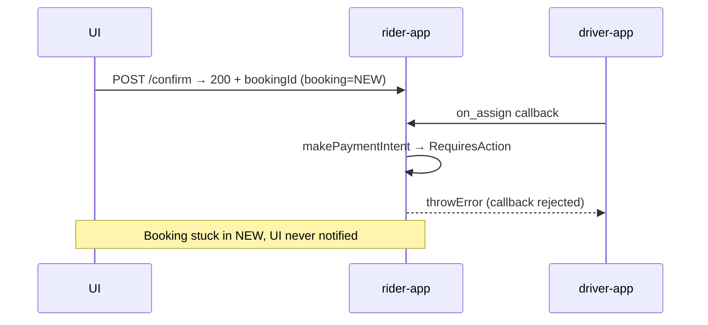

# Cancel Booking When 3DS Authentication Required

## Problem

The confirm API (`/v2/rideSearch/quotes/{quoteId}/confirm`) creates the booking synchronously and returns `200` with the booking ID. The 3DS check only happens much later, inside the BPP's `on_assign` callback in `assignRideUpdate`:




Currently `throwError` only rejects the BPP callback; the booking stays `NEW` and the rider gets no signal.

## Solution

In `assignRideUpdate` (`[Common.hs](Backend/app/rider-platform/rider-app/Main/src/Domain/Action/Beckn/Common.hs)`), before throwing the error, call `DConfirm.cancelBooking booking`. That function:

- Sets booking status → `CANCELLED`
- Deactivates `BookingPartiesLink`
- Inserts `BookingCancellationReason` (`ByApplication`)
- Sends push notification to rider via `Notify.notifyOnBookingCancelled`

The push notification is the "error" signal the UI receives.

## Changes

### 1. `Domain/Action/Beckn/Common.hs`

Add import (after existing `Domain.Action.UI.Cancel` import):

```haskell
import qualified Domain.Action.UI.Confirm as DUIConfirm
```

Change the 3DS block (lines 501–505):

```haskell
-- Block ride assignment if the Stripe card requires 3DS authentication (requires_action)
whenJust mbPaymentIntentResp $ \resp -> do
  logDebug $ "makePaymentIntent on ride assign: paymentIntentStatus=" <> show resp.paymentIntentStatus
  when (resp.paymentIntentStatus == Payment.RequiresAction) $ do
    logError $ "3DS authentication required, cancelling booking: " <> booking.id.getId
    DUIConfirm.cancelBooking booking
    throwError $ InvalidRequest "Payment requires 3DS authentication. Please verify your card to proceed."
```

`cancelBooking`'s constraints (`CacheFlow`, `EncFlow`, `EsqDBFlow`, `HasKafkaProducer`, `HasFlowEnv … internalEndPointHashMap`) are all already satisfied by `assignRideUpdate`'s context.