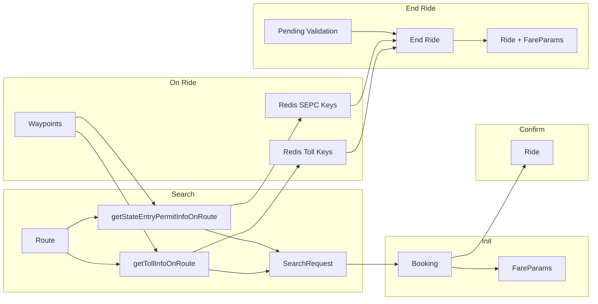

# State Entry Permit Charges – Detailed Implementation Plan

## Reference: Toll implementation

- **TollsDetector**: [Backend/app/provider-platform/dynamic-offer-driver-app/Main/src/SharedLogic/TollsDetector.hs](Backend/app/provider-platform/dynamic-offer-driver-app/Main/src/SharedLogic/TollsDetector.hs) – `getTollInfoOnRoute`, RBB + line-segment intersection, entry/exit gates, pending cache `tollStartGateTrackingKey`, `checkAndValidatePendingTolls`.
- **Redis (toll)**: `OnRideTollCharges:<driverId>`, `OnRideTollNames:<driverId>`, `OnRideTollIds:<driverId>`, `TollGateTracking:DriverId-<driverId>` (6h TTL). Defined in [Backend/lib/location-updates/src/Lib/LocationUpdates/Internal.hs](Backend/lib/location-updates/src/Lib/LocationUpdates/Internal.hs).
- **Ride/Booking/SearchRequest**: `tollCharges`, `tollNames`, `tollIds`; Ride also has `estimatedTollCharges/Names/Ids`, `tollConfidence`. YAMLs: [ride.yaml](Backend/app/provider-platform/dynamic-offer-driver-app/Main/spec/Storage/ride.yaml), [Booking.yaml](Backend/app/provider-platform/dynamic-offer-driver-app/Main/spec/Storage/Booking.yaml), [SearchRequest.yaml](Backend/app/provider-platform/dynamic-offer-driver-app/Main/spec/Storage/SearchRequest.yaml).
- **Fare params**: [Domain.Types.FareParameters](Backend/app/provider-platform/dynamic-offer-driver-app/Main/src/Domain/Types/FareParameters.hs) and FareCalculator `CalculateFareParametersParams` have `tollCharges`; FareCalculator merges `fp.tollCharges` (static) with `params.tollCharges` (dynamic) via `addMaybes`.
- **Geometry**: [Storage.Queries.Geometry](Backend/app/provider-platform/dynamic-offer-driver-app/Main/src/Storage/Queries/Geometry.hs) – `findGeometriesContaining`, `findGeometriesContainingGps`; [Domain.Types.Geometry](Backend/app/provider-platform/dynamic-offer-driver-app/Main/src/Domain/Types/Geometry.hs) has `id`, `city`, `state`, `region`, `geom`.
- **Intersection helpers**: `getBoundingBox`, `lineSegmentWithinBoundingBox`, `doIntersect` from `Kernel.Utils.ComputeIntersection` (used in TollsDetector, BlockedRouteDetector).

---

## Phase 1: Remove static toll from FarePolicy

**Goal:** Remove all static toll (FarePolicy.tollCharges). Dynamic toll and SEPC remain separate; no clubbing of static toll with dynamic.

1. **FarePolicy schema (YAML)**
  - Locate FarePolicy storage spec (Beam/table is in [Storage.Beam.FarePolicy](Backend/app/provider-platform/dynamic-offer-driver-app/Main/src/Storage/Beam/FarePolicy.hs) with `tollCharges`). If the project uses NammaDSL YAML for this table, remove `tollCharges` from the FarePolicy YAML and run generator. If FarePolicy is hand-maintained, remove the field from:
    - Domain: [Domain.Types.FarePolicy](Backend/app/provider-platform/dynamic-offer-driver-app/Main/src/Domain/Types/FarePolicy.hs) (lines 76, 246).
    - Beam: [Storage.Beam.FarePolicy](Backend/app/provider-platform/dynamic-offer-driver-app/Main/src/Storage/Beam/FarePolicy.hs).
    - Queries: [Storage.Queries.FarePolicy](Backend/app/provider-platform/dynamic-offer-driver-app/Main/src/Storage/Queries/FarePolicy.hs) (toTType'/fromTType', update').
  - Add a **migration** to drop column `fare_policy.toll_charges`.
2. **Stop using FarePolicy.tollCharges in fare calculation**
  - [SharedLogic.FareCalculator](Backend/app/provider-platform/dynamic-offer-driver-app/Main/src/SharedLogic/FareCalculator.hs): In `calculateFareParameters`, change `tollCharges = addMaybes fp.tollCharges (if isTollApplicableForTrip ... then params.tollCharges else Nothing)` to use **only** `params.tollCharges` (no `fp.tollCharges`). So: `tollCharges = if isTollApplicableForTrip fp.vehicleServiceTier fp.tripCategory then params.tollCharges else Nothing`.
  - [SharedLogic.FarePolicy](Backend/app/provider-platform/dynamic-offer-driver-app/Main/src/SharedLogic/FarePolicy.hs): Remove or repurpose `tollChargesItem` / `tollChargesCaption` that read from fare policy (breakup should show dynamic toll from fare params, not policy).
  - [SharedLogic.FareCalculator](Backend/app/provider-platform/dynamic-offer-driver-app/Main/src/SharedLogic/FareCalculator.hs): Breakup item for toll should come from `fareParams.tollCharges` only (already has `mbTollChargesItem = mkBreakupItem ... fareParams.tollCharges`).
3. **SearchTry / Driver quote**
  - [SharedLogic.SearchTry](Backend/app/provider-platform/dynamic-offer-driver-app/Main/src/SharedLogic/SearchTry.hs): Where `tollCharges` is taken from `farePolicy.tollCharges`, switch to using estimate/quote `fareParams.tollCharges` (dynamic) only.
4. **Dashboard / Merchant**
  - [Domain.Action.Dashboard.Management.Merchant](Backend/app/provider-platform/dynamic-offer-driver-app/Main/src/Domain/Action/Dashboard/Management/Merchant.hs): Remove or adjust CSV/API fields that expose `fare_policy.toll_charges` so that only dynamic toll (and later SEPC) are used.
5. **FareCalculatorV2**
  - [SharedLogic.FareCalculatorV2](Backend/app/provider-platform/dynamic-offer-driver-app/Main/src/SharedLogic/FareCalculatorV2.hs): Ensure no dependency on FarePolicy.tollCharges; it already uses params and fare params for toll. Add `stateEntryPermitCharges` to params and to computed FareParameters in a later phase.

After Phase 1: No static toll anywhere; dynamic toll is the only toll source in fare params and breakups.

---

## Phase 2: Database (Postgres) – YAML and migrations

**Rule:** All schema changes via YAML specs; run NammaDSL generator; add migrations only where YAML does not emit them.

### 2.1 New table: StateEntryPermitCharges

- **Spec (new YAML**, e.g. `spec/Storage/StateEntryPermitCharges.yaml` in dynamic-offer-driver-app/Main):
  - **Table:** `state_entry_permit_charges`
  - **Fields:**  
    - `id` (PK), `amount` (e.g. HighPrecMoney or Price), `geom_id` (FK), optional `name` / description, and any SEPC-specific flags (e.g. vehicle applicability).  
    - No `merchant_operating_city_id`, `city`, or `state` columns – state/city live in the referenced geometry row.
  - **Queries:** Fetch SEPC by joining through geometry, e.g. “all SEPC whose geometry.state is in allowedDestinationStates for this ride’s source state”; filter by state (and city if needed) via the Geometry table, not via fields on SEPC.
- **Geometry link and bounding box:** Geometry table holds the shapes per state (and “anycity” where applicable) and will also store a cached bounding box for each geometry. Columns: `id`, `state`, `city` (or `ANYCITY`), `region`, `geom`, and a **bounding_box** field derived from `geom` (used with helpers like `lineSegmentWithinBoundingBox`, `doIntersect`, etc.). `StateEntryPermitCharges.geom_id` → `Geometry.id`. Merchant_state / allowed_states: use [Domain.Types.MerchantState](Backend/app/provider-platform/dynamic-offer-driver-app/Main/src-read-only/Domain/Types/MerchantState.hs) (`state`, `allowedDestinationStates`); filter SEPC rows by joining via `geom_id` to Geometry and then applying `state ∈ allowedDestinationStates` (and any city = ANYCITY rule, if used).
- **Migration:** Add SEPC table and FK to Geometry; add appropriate indexes (e.g. on `geom_id`, and on `Geometry(state, city)` for SEPC lookups).

**Bounding-box representation and testing:**  
- Store bounding boxes in Geometry as a JSON/array of **4 points** (topLeft, topRight, bottomRight, bottomLeft); consecutive points form the 4 sides. This matches how we’ll treat them in code (array-of-points → segments).  
- For manual testing, you can draw rectangles in tools like geojson.io and copy the 4 corner coordinates into this JSON field; we **do not** create new `geom` rows for these boxes – we reuse existing `geom` shapes for states and only cache their bounding boxes alongside.

### 2.2 Ride

- **YAML:** [spec/Storage/ride.yaml](Backend/app/provider-platform/dynamic-offer-driver-app/Main/spec/Storage/ride.yaml)  
Add (parallel to toll fields):
  - `stateEntryPermitCharges`, `stateEntryPermitNames`, `stateEntryPermitIds` (detected)
  - `estimatedStateEntryPermitCharges`, `estimatedStateEntryPermitNames`, `estimatedStateEntryPermitIds`
  - `stateEntryPermitConfidence` (Maybe Confidence)
- **Migration:** Add columns (same types as toll equivalents).

### 2.3 Booking

- **YAML:** [spec/Storage/Booking.yaml](Backend/app/provider-platform/dynamic-offer-driver-app/Main/spec/Storage/Booking.yaml)  
Add: `stateEntryPermitCharges`, `stateEntryPermitNames`, `stateEntryPermitIds` (estimated at booking).

### 2.4 SearchRequest

- **YAML:** [spec/Storage/SearchRequest.yaml](Backend/app/provider-platform/dynamic-offer-driver-app/Main/spec/Storage/SearchRequest.yaml)  
Add: `stateEntryPermitCharges`, `stateEntryPermitNames`, `stateEntryPermitIds`.

### 2.5 FareParameters

- **YAML:** FareParameters is in read-only generated code; locate its spec (likely under lib or shared). Add field: `stateEntryPermitCharges :: Maybe HighPrecMoney`. Fare breakdown: separate line item for state entry permit (names/IDs can be in domain or API type for debugging).
- **Domain:** [Domain.Types.FareParameters](Backend/app/provider-platform/dynamic-offer-driver-app/Main/src/Domain/Types/FareParameters.hs) – add `stateEntryPermitCharges`. Beam and Queries will be regenerated or updated accordingly.

### 2.6 BookingUpdateRequest

- No extra columns needed if SEPC is carried only via new FareParameters (fareParamsId). If BUR needs to expose SEPC explicitly, add same triple (charges, names, ids) as in Booking; otherwise rely on fare params.

### 2.7 DailyStats

- **YAML:** [spec/Storage/DailyStats.yaml](Backend/app/provider-platform/dynamic-offer-driver-app/Main/spec/Storage/DailyStats.yaml)  
Add: `stateEntryPermitCharges` (same pattern as `tollCharges`). Update `updateByDriverId` params to include it.

After Phase 2: Run NammaDSL generator; run migrations; fix any compile errors in generated code.

---

## Phase 3: Redis keys and usage

**New keys (mirror toll keys; no "pending" key for SEPC):**

| Key                                        | Purpose                             | TTL         |
| ------------------------------------------ | ----------------------------------- | ----------- |
| `OnRideStateEntryPermitCharges:<driverId>` | Accumulated SEPC amount during ride | 6h (21600s) |
| `OnRideStateEntryPermitNames:<driverId>`   | List of SEPC names detected         | 6h          |
| `OnRideStateEntryPermitIds:<driverId>`     | List of SEPC IDs detected           | 6h          |

**Where to define:**  

There is **no** Redis key for "pending SEPC crossing" (unlike toll's `TollGateTracking:DriverId-<driverId>`). SEPC reconciliation is done only at end ride by comparing estimated vs detected IDs; see Phase 4 "Validation at end ride."

- In **location-updates** lib ([Lib/LocationUpdates/Internal.hs](Backend/lib/location-updates/src/Lib/LocationUpdates/Internal.hs)): on-ride SEPC keys and accumulation (same pattern as OnRideTollCharges/Names/Ids). Location-updates is used by provider; it currently takes `updateTollChargesAndNamesAndIds` and similar from the app. So either: (a) extend the handler to also accept `updateStateEntryPermitChargesAndNamesAndIds` and new keys, or (b) keep SEPC accumulation in provider and call into location-updates with a combined “toll + SEPC” result. Prefer (a) for symmetry: add SEPC keys and an update callback in the same way as toll.

**Cleanup:** On ride end, clear SEPC keys and pending (same as `clearTollStartGateBatchCache` and `redisOnRideKeysCleanup`). TTLs (e.g. 6h) on the per-driver SEPC Redis keys are a safety net only – the **primary** cleanup is the explicit delete at ride end, so a driver’s keys won’t be shared across multiple rides even if they drive for a very long time.

---

## Phase 4: StateEntryPermitDetector logic

**New module** (e.g. `SharedLogic.StateEntryPermitDetector` in dynamic-offer-driver-app):

1. **Inputs:** `Id MerchantOperatingCity`, `Maybe (Id Driver)` (for on-ride pending), route polyline (list of points).
2. **Step 1 – Allowed states of source:**
  Resolve source state (e.g. from pickup lat/lon: which state contains it, or from MerchantState). Get MerchantState row(s) where `state` = source state; read `allowedDestinationStates`. (If product uses “source” as city/region, filter accordingly.)
3. **Step 2 – Candidate SEPC rows:**
  Fetch all StateEntryPermitCharges for the merchant operating city whose `state` is in the set from Step 1.
4. **Step 3 – SBB:**
  For each candidate SEPC row, get bounding box (from stored bbox or from Geometry by geom_id). Build one SBB per state or union; same as toll “eligible that maybe present” filter.
5. **Step 4 – RBB:**
  `getBoundingBox(route)`.
6. **Step 5 – Filter by RBB vs SBB (intersection only):**
  For each candidate state’s SBB: check if any side of RBB **intersects** any side of SBB (existing `doIntersect`). If there is no intersection, skip that state. Do **not** check “RBB fully within SBB” – that case (route entirely inside one state) does not imply a border crossing and would add unnecessary work in Step 6 with no charge applied.
7. **Step 6 – In-memory segment loop (candidate states only):**
  - Fetch that state’s geom(s) once (by geom_id from SEPC rows); load polygon(s) in memory.  
  - For each consecutive pair (p1, p2) of route:  
    - areaFirst = which state(s) contain p1 (point-in-polygon on fetched geoms).  
    - areaSecond = which state(s) contain p2.  
    - **Overlap rule:** If either point is in more than one geom, skip this segment; move to next pair.  
  - **Charge rule:** If areaSecond is in SEPC and areaSecond ≠ areaFirst, add areaSecond’s charge and record name/id – but only if this is the **first time** we are entering that SEPC state on this ride. Maintain a per-ride set of “already charged” SEPC state IDs and skip charges for subsequent zig-zag re-entries into the same state.  
    - **Unknown:** If areaSecond is “unknown” (no geom contains p2), do not charge. If areaFirst unknown and areaSecond in SEPC, charge (entry into permit state).
8. **Return type:** `Maybe (HighPrecMoney, [Text], [Text])` (charges, names, ids) – same shape as toll for easy reuse in fare params and ride.

**Geometry / point-in-polygon:** Use existing `findGeometriesContaining` / `findGeometriesContainingGps` only where cheap (e.g. after narrowing candidate geoms by state). Prefer: fetch candidate geoms once by geom_id, then in-memory point-in-polygon for each route point to avoid per-point DB cost.  
**In-pod geom cache:** To avoid hitting Postgres for geoms on every request, cache SEPC geoms and their bounding boxes in-process using `IM.withInMemCache`, keyed by a **versioned** cache key, e.g. `["CACHED_SEPC_GEOMS", "geom:v3"]`, with a TTL (e.g. 12 hours). On first call for SEPC in a pod, load all SEPC rows + their geoms (or per-state slice), build in-memory structures, and store them under this key. When geom data changes (migration or manual update), bump the version (`geom:v3` → `geom:v4`) in config/code; this automatically invalidates old entries and forces a fresh load on the next request, while TTL provides an additional safety net.

**Validation at end ride (no per-batch pending):** SEPC does not use a “pending crossing” Redis key like tolls (toll has entry-gate-detected-but-exit-not-found across batches). For SEPC, crossing is detected per segment (p1, p2) immediately, so there is no batch-to-batch “resume.” Implement `checkAndValidatePendingStateEntryPermits`: at end ride only, compare **estimated** SEPC IDs (from booking/ride) with **detected** IDs (from Redis/ride accumulation), and combine them with distance-calculation status + pickup/drop threshold:  

- If `estimatedIds == detectedIds` and tracking is healthy → **Sure**, use **detected** SEPC charges.  
- If tracking/distance calculation clearly failed → **Unsure/Neutral**, use **estimated** SEPC charges only (conservative, estimate-based).  
- If tracking is healthy and IDs differ:  
  - When pickup/drop is **outside** threshold (route clearly changed) → **Sure**, use **detected** SEPC charges.  
  - When pickup/drop is **within** threshold (route broadly as expected) → **Neutral**, prefer **estimated** SEPC (do not newly charge SEPC IDs that were never present in the estimate unless product explicitly allows).  
  No Redis key for “pending SEPC crossing” is required.

---

## Phase 5: Flow-by-flow changes

### 5.1 Search ([Domain.Action.Beckn.Search](Backend/app/provider-platform/dynamic-offer-driver-app/Main/src/Domain/Action/Beckn/Search.hs))

- **Current:** After route serviceability, calls `getTollInfoOnRoute merchantOpCityId Nothing serviceableRoute.routePoints`; builds search request with `mbTollCharges`, `mbTollNames`, `mbTollIds`, and passes them into `buildSearchRequest`, `buildEstimate`, `buildQuote`.
- **Change:**  
  - Call `getStateEntryPermitInfoOnRoute merchantOpCityId Nothing serviceableRoute.routePoints` (new function from StateEntryPermitDetector).  
  - Add `mbStateEntryPermitCharges`, `mbStateEntryPermitNames`, `mbStateEntryPermitIds` to the tuple and to `buildSearchRequest`.  
  - In `buildEstimate` and `buildQuote`, pass SEPC into fare params (e.g. when building FareParameters for estimates/quotes, include `stateEntryPermitCharges`).  
  - Ensure `selectFarePolicy` / vehicle filters do not depend on SEPC (no “auto not allowed” style check for SEPC unless product requires it).

**Exact logic:** Same as toll: one-shot route → get route points → get toll info + state permit info → store both on SearchRequest and in estimate/quote fare params.

### 5.2 Init ([Domain.Action.Beckn.Init](Backend/app/provider-platform/dynamic-offer-driver-app/Main/src/Domain/Action/Beckn/Init.hs))

- **Current:** `buildBooking` sets `tollCharges`, `tollNames`, `tollIds` from `searchRequest` when `isTollApplicable`. Fare params come from quote/estimate (already have tollCharges).
- **Change:**  
  - Add `stateEntryPermitCharges`, `stateEntryPermitNames`, `stateEntryPermitIds` to Booking from searchRequest (same conditional as toll if needed, or always when present).  
  - Ensure booking.fareParams include `stateEntryPermitCharges` (FareParameters created at Init/quote already carry it from buildQuote/buildEstimate).

**Exact logic:** Copy toll pattern: `stateEntryPermitCharges = if isTollApplicable then searchRequest.stateEntryPermitCharges else Nothing` (or a dedicated “isStatePermitApplicable” if product differs).

### 5.3 Confirm / Ride creation ([SharedLogic.Ride](Backend/app/provider-platform/dynamic-offer-driver-app/Main/src/SharedLogic/Ride.hs))

- **Current:** Ride is created with `estimatedTollCharges = booking.tollCharges`, `estimatedTollNames = booking.tollNames`, `estimatedTollIds = booking.tollIds`.
- **Change:** Set `estimatedStateEntryPermitCharges = booking.stateEntryPermitCharges`, `estimatedStateEntryPermitNames = booking.stateEntryPermitNames`, `estimatedStateEntryPermitIds = booking.stateEntryPermitIds`.

**Exact logic:** Mirror the three estimated toll fields with three estimated SEPC fields from booking.

### 5.4 Update – Edit destination ([Domain.Action.Beckn.Update](Backend/app/provider-platform/dynamic-offer-driver-app/Main/src/Domain/Action/Beckn/Update.hs))

- **Current:** Gets `shortestRoute` from route response; calls `getTollInfoOnRoute merchantOperatingCity.id (Just person.id) shortestRoute.points`; validates toll allowed for vehicle; passes `tollCharges` into `CalculateFareParametersParams` and builds BookingUpdateRequest with new fare params.
- **Change:**  
  - Call `getStateEntryPermitInfoOnRoute merchantOperatingCity.id (Just person.id) shortestRoute.points`.  
  - Pass `stateEntryPermitCharges` (and names/ids if needed for breakup) into `CalculateFareParametersParams`.  
  - No separate “SEPC not allowed” rejection unless product requires it (plan does not mandate it).  
  - New FareParameters row for the update includes both `tollCharges` and `stateEntryPermitCharges`.

**Exact logic:** Same as toll: new route polyline → one-shot get toll + get state permit info → feed both into fare params for the edit-destination quote.

### 5.5 On-ride – Location updates ([Lib.LocationUpdates.Internal](Backend/lib/location-updates/src/Lib/LocationUpdates/Internal.hs) + provider)

- **Current:** `recalcDistanceBatchStep` calls `interpolatePointsAndCalculateDistanceAndToll`; on result it pushes toll names/ids and increments toll charges in Redis; then `updateTollChargesAndNamesAndIds` is called. Handler has `getTollInfoOnTheRoute`, `getTravelledDistanceAndTollInfo` (estimated toll info).
- **Change:**  
  - Extend interpolation/toll step to also compute SEPC on the batch (or accept a combined “toll + SEPC” callback). Prefer: provider passes `getStateEntryPermitInfoOnRoute` and a new callback `updateStateEntryPermitChargesAndNamesAndIds`.  
  - In the handler: for each batch, call toll detector and state permit detector; accumulate toll in existing Redis keys; accumulate SEPC in new Redis keys; when “exit/unknown without entry into known permit state”, accumulate SEPC in the three OnRide SEPC keys (no pending key).  
  - `getTravelledDistanceAndTollInfo` can return both toll and SEPC info so end ride has full picture.  
  - Cleanup: on ride end, clear SEPC Redis keys and pending (in provider’s end-ride flow and in location-updates cleanup if called).

**Exact logic:** Mirror toll: per batch waypoints → getTollInfoOnRoute + getStateEntryPermitInfoOnRoute → accumulate toll (existing) and SEPC (new keys); update ride via `updateTollChargesAndNamesAndIds` and `updateStateEntryPermitChargesAndNamesAndIds`; pending SEPC when segment gives “unknown” or exit but no entry.

### 5.6 End ride ([Domain.Action.UI.Ride.EndRide](Backend/app/provider-platform/dynamic-offer-driver-app/Main/src/Domain/Action/UI/Ride/EndRide.hs) + Internal)

- **Current:**  
  - `finalDistanceCalculation` is called with estimated toll (charges, names, ids).  
  - After that, `checkAndValidatePendingTolls` runs; then `(tollCharges, tollNames, tollIds, tollConfidence)` are computed with Sure/Neutral/Unsure rules; ride is updated; fare params are recalculated with `tollCharges`.
- **Change:**  
  - Pass **estimated state permit** (charges, names, ids) into `finalDistanceCalculation` (extend signature) so that when waypoints are processed, SEPC is also accumulated (provider’s handler already accumulates SEPC in Redis; `finalDistanceCalculation` will have run the last batch and updated ride with detected SEPC via `updateStateEntryPermitChargesAndNamesAndIds`).  
  - After `finalDistanceCalculation`, call `checkAndValidatePendingStateEntryPermits` (estimated SEPC IDs, detected SEPC IDs; no Redis pending – see Phase 4).  
  - Compute `(stateEntryPermitCharges, stateEntryPermitNames, stateEntryPermitIds, stateEntryPermitConfidence)` using SEPC-specific rules (mirroring toll structure but ID-based):  
    - **IDs match & tracking healthy:** `estimatedIds == detectedIds` → **Sure**, use **detected** SEPC charges.  
    - **Tracking/distance failed:** detector not trustworthy → **Unsure/Neutral**, use **estimated** SEPC charges only.  
    - **Tracking healthy & IDs differ:**  
      - Pickup/drop **outside** threshold (route clearly changed) → **Sure**, use **detected** SEPC charges.  
      - Pickup/drop **within** threshold (route broadly as expected) → **Neutral**, prefer **estimated** SEPC; do not newly charge SEPC IDs that were never present in the estimate unless explicitly allowed.
  - Update ride with both toll and SEPC fields.  
  - Recalculate fare params with both `tollCharges` and `stateEntryPermitCharges`; pureFareSum / final fare = base + … + toll + stateEntryPermit.  
  - Clear the three SEPC Redis keys in end-ride cleanup (no pending cache for SEPC).  
  - Driver wallet / invoice / DailyStats: include both toll and state entry permit amounts (DriverScore, DailyStats updateByDriverId already has tollCharges; add stateEntryPermitCharges).

**Exact logic:** Duplicate the toll confidence block for SEPC: same branching on distanceCalculationFailed, canApplyValidatedPending, mbValidatedPending; set stateEntryPermitConfidence to Sure/Neutral/Unsure/Nothing accordingly; then persist ride and fare params.

### 5.7 Fare parameters and breakup

- **CalculateFareParametersParams:** Add `stateEntryPermitCharges :: Maybe HighPrecMoney` (and names/ids if needed for breakup).  
- **calculateFareParameters / calculateFareParametersV2:** Include `stateEntryPermitCharges` in the returned FareParameters; add to pureFareSum (and any breakup list).  
- **Breakup:** Separate line items for “Toll charges” and “State entry permit charges”; names/IDs can be stored or exposed for debugging.  
- **APIs:** Response types (e.g. ride info, booking info, estimate/quote) expose two fields: `tollCharges` and `stateEntryPermitCharges` (and optionally tollNames/Ids and stateEntryPermitNames/Ids). Frontend receives both separately; no single combined “tollCharges” that sums both.

### 5.8 Other touchpoints

- **Select/Cancel/Confirm (trip quote detail):** [Domain.Action.Beckn.Select](Backend/app/provider-platform/dynamic-offer-driver-app/Main/src/Domain/Action/Beckn/Select.hs), [Confirm](Backend/app/provider-platform/dynamic-offer-driver-app/Main/src/Domain/Action/Beckn/Confirm.hs), [SharedLogic.Cancel](Backend/app/provider-platform/dynamic-offer-driver-app/Main/src/SharedLogic/Cancel.hs) pass `tollCharges` into `buildTripQuoteDetail`. Add `stateEntryPermitCharges` to the quote detail and to API entities (e.g. [SendSearchRequestToDrivers](Backend/app/provider-platform/dynamic-offer-driver-app/Main/src/SharedLogic/Allocator/Jobs/SendSearchRequestToDrivers/Handle/Internal/SendSearchRequestToDrivers.hs), [Driver](Backend/app/provider-platform/dynamic-offer-driver-app/Main/src/Domain/Action/UI/Driver.hs)).
- **Driver dashboard / stats:** [Domain.Action.UI.Driver](Backend/app/provider-platform/dynamic-offer-driver-app/Main/src/Domain/Action/UI/Driver.hs) – `totalEarningOfDayExcludingTollCharges`; add state entry permit to earnings or exclude consistently; DailyStats update includes `stateEntryPermitCharges`.
- **DriverWallet / EndRide Internal:** [Domain.Action.UI.Ride.EndRide.Internal](Backend/app/provider-platform/dynamic-offer-driver-app/Main/src/Domain/Action/UI/Ride/EndRide/Internal.hs) – invoice/line items: add state entry permit as separate line; use `fareParams.stateEntryPermitCharges` and ride’s stateEntryPermit* for display.
- **GpsTollBehavior:** No change for SEPC unless product wants similar “GPS off on state permit route” behavior (out of scope unless specified).
- **Rider app / BAP:** If rider app or BAP sends/expects toll in payloads, add separate stateEntryPermit fields in those payloads (two separate fields).

---

## Phase 6: API and frontend contract

**Change from current behaviour:** Previously, API responses sent only **tollCharges** (and optionally tollNames/tollIds) for ride, booking, estimate, quote, trip quote detail, and related endpoints. There was no state entry permit in the API. **Every API that used to return only toll charges must now also return state entry permit charges** in those same APIs – both on the backend (response payload) and on the frontend (where those responses are consumed and displayed).

**New contract:** All relevant API responses must now send **both** of the following as **two separate fields** (backend and frontend keep them separate; do not club them into one):

- **tollCharges** (and optionally tollNames, tollIds) – dynamic toll only (static toll removed from FarePolicy).
- **stateEntryPermitCharges** (and optionally stateEntryPermitNames, stateEntryPermitIds) – state entry permit charges.

**Where to add the new fields:** Every response type that currently exposes tollCharges must also expose stateEntryPermitCharges (and names/IDs if exposed for toll). Examples: ride info, booking info, estimate, quote, trip quote detail (Select, Confirm, Cancel, SendSearchRequestToDrivers, Driver APIs), fare breakup, end-ride response, and any BAP/rider payloads that include toll. Frontend receives both fields separately and displays them separately; no single combined tollCharges that sums toll + SEPC.

(Redundant bullets removed; see above.)

- Backend keeps **two separate fields**: `tollCharges` and `stateEntryPermitCharges` (and their names/IDs where applicable).  
- APIs (provider and rider) send **two separate fields**; frontend shows them separately.  
- No single “tollCharges” that combines dynamic toll + SEPC.

---

## Summary diagram (high level)

---

## Order of implementation (recommended)

1. Phase 1 – Remove FarePolicy.tollCharges and all static toll usage.
2. Phase 2 – Add Postgres (StateEntryPermitCharges table + new columns on Ride, Booking, SearchRequest, FareParameters, DailyStats); run generator and migrations.
3. Phase 3 – Define Redis keys and cleanup; extend location-updates handler interface for SEPC.
4. Phase 4 – Implement StateEntryPermitDetector (Steps 1–6 + pending + checkAndValidatePendingStateEntryPermits).
5. Phase 5 – Wire SEPC into Search → Init → Confirm → Update → On-ride → End ride and fare/breakup/APIs.
6. Phase 6 – Confirm API contract (two separate fields) and any rider/BAP payload updates.

Where behaviour is ambiguous (e.g. “allowed states of source” exact semantics, or which state to use for pickup), mirror toll behaviour for that flow or call out for product decision.