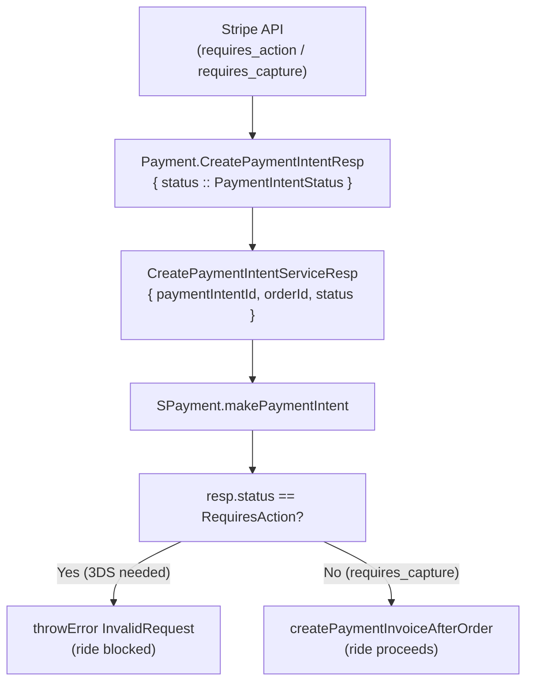

# Stripe PI Status — Block 3DS Cards at Ride Assignment

## Changes Required

### 1. `[lib/payment/src/Lib/Payment/Domain/Action.hs](Backend/lib/payment/src/Lib/Payment/Domain/Action.hs)`

**Step 1a — Add `status` field to the response type (lines 169-173):**

```haskell
data CreatePaymentIntentServiceResp = CreatePaymentIntentServiceResp
  { paymentIntentId :: Text,
    orderId :: Id DOrder.PaymentOrder,
    status :: Payment.PaymentIntentStatus   -- add this
  }
  deriving (Show, Eq, Generic)
```

**Step 1b — Populate at line 223 (new order path):**

```haskell
return CreatePaymentIntentServiceResp
  { paymentIntentId = createPaymentIntentResp.paymentIntentId,
    orderId = newOrderId,
    status = createPaymentIntentResp.status   -- add this
  }
```

**Step 1c — Populate at line 274 (`createNewTransaction`):**

```haskell
return CreatePaymentIntentServiceResp
  { paymentIntentId = createPaymentIntentResp.paymentIntentId,
    orderId = existingOrder.id,
    status = createPaymentIntentResp.status   -- add this
  }
```

**Step 1d — Populate at line 284 (`updateOldTransaction`):**

No Stripe API call is made here — the existing in-progress transaction's status is reused. Convert it back using `Payment.caseToPaymentIntentStatus`:

```haskell
return CreatePaymentIntentServiceResp
  { paymentIntentId = existingOrder.paymentServiceOrderId,
    orderId = existingOrder.id,
    status = Payment.caseToPaymentIntentStatus existingTransaction.status   -- add this
  }
```

`existingTransaction` is already in scope (it's the `Just existingTransaction` matched from `mbInProgressTransaction`).

---

### 2. `[app/rider-platform/rider-app/Main/src/Domain/Action/Beckn/Common.hs](Backend/app/rider-platform/rider-app/Main/src/Domain/Action/Beckn/Common.hs)`

`Kernel.External.Payment.Interface.Types as Payment` is already imported (line 63), so `Payment.RequiresAction` is directly accessible.

After the `mbPaymentIntentResp` block (after line 500), add the guard:

```haskell
-- Block ride assignment if Stripe card needs 3DS (requires_action)
whenJust mbPaymentIntentResp $ \resp ->
  when (resp.status == Payment.RequiresAction) $
    throwError $ InvalidRequest "Payment requires 3DS authentication. Please verify your card to proceed."
```

This must come **before** `createPaymentInvoiceAfterOrder` to prevent any DB writes when the card is blocked.

---

## Data Flow (after change)




