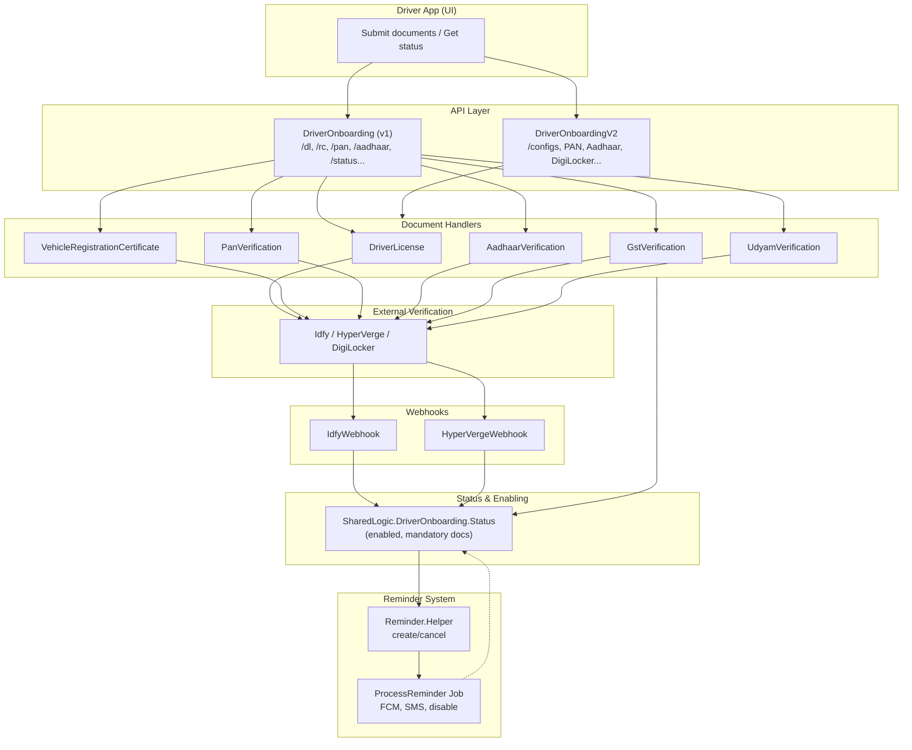
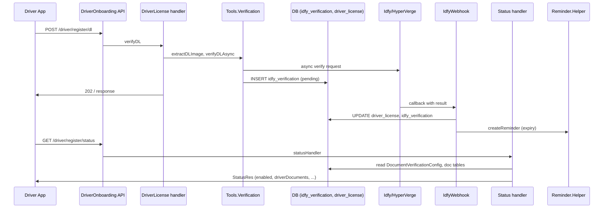
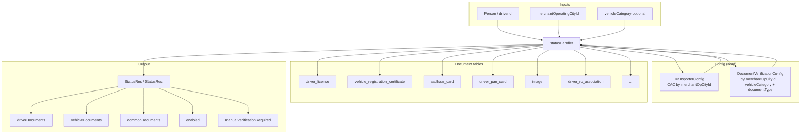
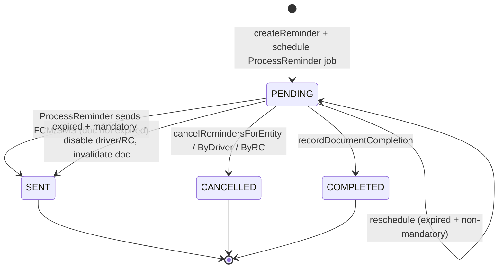
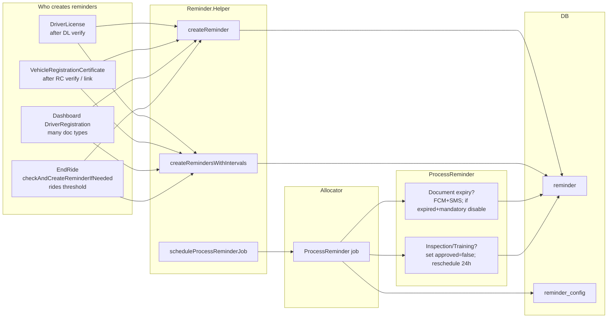
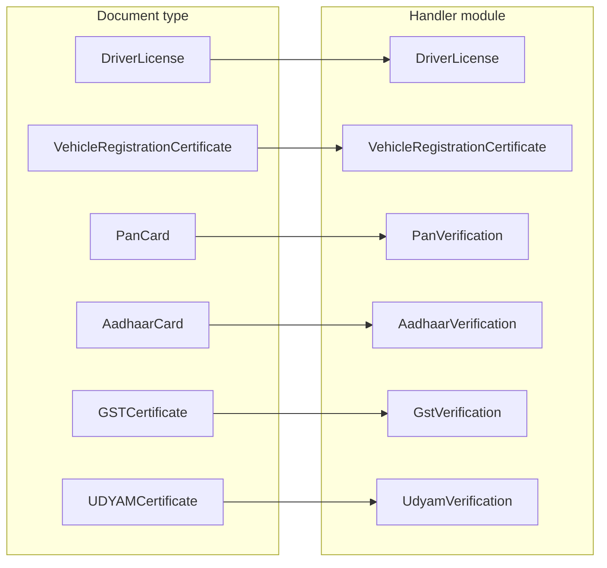

# Onboarding — Diagrams Reference

This document contains **Mermaid diagrams** for driver and document onboarding in **dynamic-offer-driver-app**. Use it alongside [ONBOARDING_GUIDE.md](./ONBOARDING_GUIDE.md). Diagrams render in GitHub, GitLab, and many Markdown viewers.

---

## 1. High-level onboarding flow



---

## 2. Async document verification (e.g. DL)



---

## 3. Status computation (“enabled” and document list)



---

## 4. Reminder lifecycle



---

## 5. Reminder creation vs processing



---

## 6. Config hierarchy

```mermaid
flowchart TB
  subgraph City["Per merchantOperatingCityId"]
    TC[TransporterConfig]
    TC --- "reminderSystemEnabled"
    TC --- "aadhaarVerificationRequired"
    TC --- "onboardingTryLimit"
    TC --- "digilockerEnabled"
    TC --- "requiresOnboardingInspection"
  end

  subgraph DocType["Per documentType (+ city)"]
    DVC[DocumentVerificationConfig\nmerchantOpCityId + vehicleCategory + documentType]
    DVC --- "isMandatory, isMandatoryForEnabling"
    DVC --- "checkExtraction, checkExpiry"
    DVC --- "order, supportedVehicleClasses"
    RC[ReminderConfig\nmerchantOpCityId + documentType]
    RC --- "reminderIntervals [30,15,1]"
    RC --- "enabled, isMandatory"
    RC --- "daysThreshold, ridesThreshold"
  end

  TC --> DVC
  TC --> RC
  DVC --> Status[Status / Document handlers]
  RC --> ProcessReminder[ProcessReminder job]
  TC --> ProcessReminder
```

---

## 7. Table relationships (onboarding core)

```mermaid
erDiagram
  person ||--o{ driver_license : "has"
  person ||--o{ driver_rc_association : "has"
  person ||--o{ aadhaar_card : "has"
  person ||--o{ driver_pan_card : "has"
  person ||--o{ driver_gstin : "has"
  person ||--o{ idfy_verification : "has"
  person ||--o{ reminder : "driverId"
  person }o--|| merchant_operating_city : "belongs to"

  vehicle_registration_certificate ||--o{ driver_rc_association : "linked by"
  vehicle_registration_certificate ||--o{ vehicle_permit : "has"
  vehicle_registration_certificate ||--o{ vehicle_insurance : "has"
  vehicle_registration_certificate ||--o{ vehicle_puc : "has"
  vehicle_registration_certificate ||--o{ vehicle_fitness_certificate : "has"

  document_verification_config }o--|| merchant_operating_city : "per city"
  reminder_config }o--|| merchant_operating_city : "per city"
  transporter_config }o--|| merchant_operating_city : "per city"

  reminder }o--|| reminder_config : "uses"
  reminder ||--o{ document_reminder_history : "completion"

  image ||--o{ driver_license : "documentImageId"
  image ||--o{ vehicle_registration_certificate : "documentImageId"
  image ||--o{ idfy_verification : "documentImageId1"

  person {
    id Id
    merchant_operating_city_id Id
  }

  driver_license {
    id Id
    driver_id Id
    verification_status VerificationStatus
    document_expiry UTCTime
  }

  vehicle_registration_certificate {
    id Id
    verification_status VerificationStatus
    approved Bool
  }

  document_verification_config {
    merchant_operating_city_id Id
    vehicle_category VehicleCategory
    document_type DocumentType
    is_mandatory Bool
    check_expiry Bool
  }

  reminder {
    id Id
    document_type DocumentType
    entity_id Text
    driver_id Id
    due_date UTCTime
    status ReminderStatus
  }

  reminder_config {
    merchant_operating_city_id Id
    document_type DocumentType
    reminder_intervals "[]Int"
    enabled Bool
    is_mandatory Bool
  }
```

---

## 8. Document types and handlers (quick map)



---

## 9. Reminder types (expiry vs inspection/training)

```mermaid
flowchart TB
  subgraph Expiry["Document expiry reminders"]
    E1[DriverLicense]
    E2[VehicleRegistrationCertificate]
    E3[VehicleInsurance]
    E4[VehiclePermit]
    E5[VehiclePUC]
    E6[VehicleFitnessCertificate]
    E7[BusinessLicense]
  end

  subgraph Inspection["Inspection / training reminders"]
    I1[VehicleInspectionForm]
    I2[DriverInspectionForm]
    I3[TrainingForm]
  end

  Expiry --> "reminderIntervals\nT-30, T-15, T-1 days"
  Inspection --> "daysThreshold / ridesThreshold\n+ reschedule every 24h"
```

---

*For narrative and file paths, see [ONBOARDING_GUIDE.md](./ONBOARDING_GUIDE.md).*
