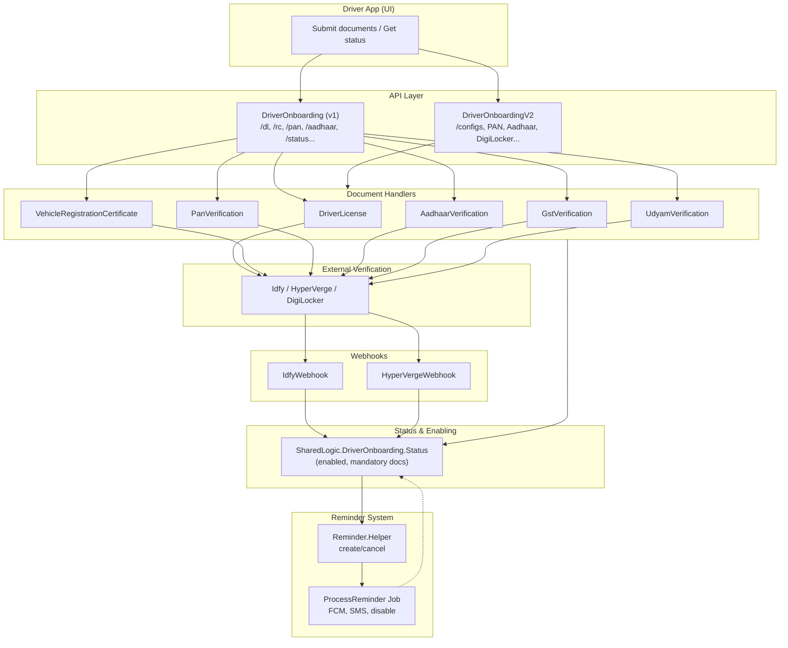
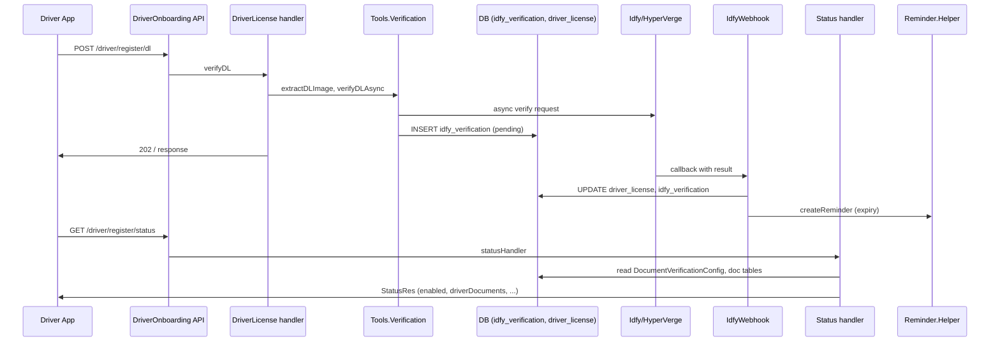
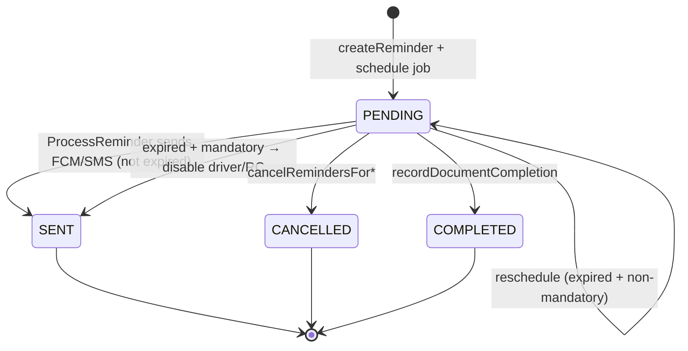
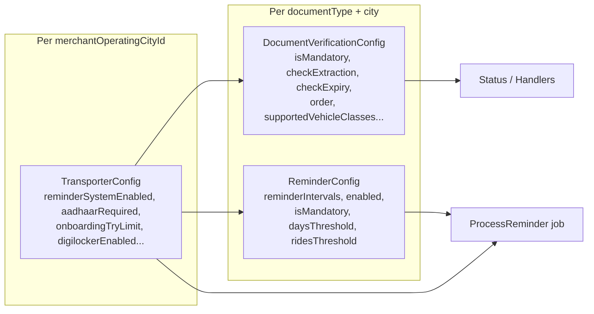

# Driver & Document Onboarding in dynamic-offer-driver-app

This guide explains how driver and document onboarding works in the **dynamic-offer-driver-app** (MSIL / Namma Yatri provider platform), including the **reminder module**, **tables involved**, and **where config lives**. It is written for developers new to the project.

For **diagrams only** (flow, config, reminders, tables), see **[ONBOARDING_DIAGRAMS.md](./ONBOARDING_DIAGRAMS.md)**.

---

## 1. High-level flow

- **Driver onboarding** = driver registers and submits documents (DL, RC, PAN, Aadhaar, GST, etc.).
- **Document verification** = backend sends images/data to Idfy/HyperVerge (or DigiLocker); results come back via **webhooks** and update DB (e.g. `verificationStatus`).
- **Status** = a single API that returns “what’s done, what’s pending, is driver enabled” using **DocumentVerificationConfig** and **TransporterConfig**.
- **Reminders** = scheduled jobs (document expiry, inspection, training) that send FCM/SMS and can disable driver or RC if overdue.

---

## 2. API entry points

### 2.1 UI APIs (driver app)

- **V1 (legacy):** `Main/src/API/UI/DriverOnboarding.hs`
  - Base path: `"driver" :> "register"` under the UI API.
  - Endpoints: `dl`, `rc`, `pan`, `gstin`, `udyam`, `aadhaar`, `status`, `validateImage`, `validateDocumentImage`, `generateAadhaarOtp`, `verifyAadhaarOtp`, `unVerifiedAadhaarData`, etc.
  - Each document type (DL, RC, PAN, …) has a **POST** for submit and **status** is a **GET**.

- **V2:** Generated from `Main/spec/API/DriverOnboarding.yaml`.
  - Handlers in: `Main/src/Domain/Action/UI/DriverOnboardingV2.hs`.
  - Used for: onboarding configs, PAN/Aadhaar/bank/SSN/DigiLocker flows, fleet RCs, linkToFleet, etc.

### 2.2 Webhooks (verification providers)

- **Idfy:** `IdfyWebhookAPI` — receives async verification results (DL, RC, PAN, GST, Udyam, etc.).
- **HyperVerge:** `HyperVergeResultWebhookAPI`, `HyperVergeVerificationWebhookAPI` — SDK/verification callbacks.

Webhook handlers dispatch by **document type** and update the corresponding tables (e.g. `driver_license`, `vehicle_registration_certificate`, `idfy_verification`).

---

## 3. Document onboarding flow (per document type)

| Document   | Handler module                                      | Main actions |
|-----------|------------------------------------------------------|--------------|
| **DL**    | `Domain.Action.UI.DriverOnboarding.DriverLicense`    | `verifyDL`; extract → verify (async) → webhook updates status; **reminders** for expiry. |
| **RC**    | `Domain.Action.UI.DriverOnboarding.VehicleRegistrationCertificate` | `verifyRC`, link/delete RC; expiry + linked docs; **reminders**. |
| **PAN**   | `Domain.Action.UI.DriverOnboarding.PanVerification`   | `verifyPan`; Idfy/HyperVerge; PAN–Aadhaar linkage. |
| **Aadhaar** | `Domain.Action.UI.DriverOnboarding.AadhaarVerification` | OTP generate/verify, image verify; can trigger PAN–Aadhaar link. |
| **GST**   | `Domain.Action.UI.DriverOnboarding.GstVerification`  | `verifyGstin`; extract + async verify. |
| **Udyam** | `Domain.Action.UI.DriverOnboarding.UdyamVerification` | `verifyUdyam`. |
| **Bank**  | `Domain.Action.UI.DriverOnboarding.BankAccountVerification` | Bank verification (async). |
| **Common docs** | `DriverOnboardingV2` + `CommonDriverOnboardingDocuments` | Generic doc types (e.g. SSN, custom). |

Shared orchestration and helpers:

- **`SharedLogic.DriverOnboarding`** — re-exports and common helpers.
- **`SharedLogic.DriverOnboarding.Status`** — core logic for “is driver enabled?”, “what’s the status of each doc?” (uses **DocumentVerificationConfig** and **TransporterConfig**).

Flow for a typical document (e.g. DL):

1. App calls e.g. `POST .../driver/register/dl` with payload (DL number, image IDs, etc.).
2. Handler (e.g. `DriverLicense.verifyDL`) runs validations, calls **Tools.Verification** (e.g. `extractDLImage`, `verifyDLAsync`).
3. For async verification, a row is written to **IdfyVerification** (or HyperVerge equivalent) with `requestId`, `docType`, `status = "pending"`.
4. Provider (Idfy/HyperVerge) processes and hits our **webhook**.
5. Webhook handler (e.g. `IdfyWebhook`, `HyperVergeWebhook`) updates the document table (`driver_license`, etc.) and possibly **Image** verification status.
6. After any doc update, **status** can be called to refresh “enabled” and list of pending/valid docs; **reminders** may be created/updated.

---

## 4. Status and “enabled” logic

- **Entry:** `Domain.Action.UI.DriverOnboarding.Status.statusHandler` (used from UI and from other flows).
- **Implementation:** `SharedLogic.DriverOnboarding.Status.statusHandler'`.

What it does:

- Loads **TransporterConfig** (e.g. `Storage.Cac.TransporterConfig.findByMerchantOpCityId`) for the driver’s merchant/city.
- Loads **DocumentVerificationConfig** (per merchantOperatingCityId + vehicleCategory + documentType) to know which docs are **mandatory** and how to treat them.
- For each document type (DL, RC, Aadhaar, PAN, etc.):
  - Reads from the corresponding tables (DriverLicense, VehicleRegistrationCertificate, AadhaarCard, DriverPanCard, etc.) and optionally **Image**.
  - Maps to a **ResponseStatus**: e.g. `NO_DOC_AVAILABLE`, `PENDING`, `VALID`, `FAILED`, `INVALID`, `MANUAL_VERIFICATION_REQUIRED`, etc.
- Computes **enabled**: driver can go “live” only when all **mandatory** documents (per config) are **VALID** and other business rules (e.g. RC approved, inspections if required) are met.
- Returns **StatusRes** / **StatusRes'** with `driverDocuments`, `vehicleDocuments`, `commonDocuments`, `enabled`, `manualVerificationRequired`, DL/RC details, DigiLocker status, etc.

So: **config that drives “what is mandatory” and “what is checked” for onboarding sits in DocumentVerificationConfig and TransporterConfig** (see section 7).

---

## 5. Reminder module (in detail)

### 5.1 Purpose

- **Document expiry reminders:** e.g. DL, RC, VehicleInsurance, VehiclePermit, VehiclePUC, VehicleFitnessCertificate, BusinessLicense.
  Remind at T-30, T-15, T-1 days (configurable). When **expired** and **mandatory**, driver/RC can be disabled and document marked invalid.
- **Inspection / training reminders:** e.g. VehicleInspectionForm, DriverInspectionForm, TrainingForm.
  Based on **ridesThreshold** or **daysThreshold**. Can set RC/driver approved = false, invalidate images, or disable driver when overdue and mandatory.

### 5.2 Where it lives

| Component        | Path |
|-----------------|------|
| **Job processor** | `Main/src/SharedLogic/Allocator/Jobs/Reminder/ProcessReminder.hs` — `processReminder`, `processReminderByType`. |
| **Helper (create/cancel/schedule)** | `Main/src/SharedLogic/Reminder/Helper.hs` — `createReminder`, `cancelRemindersForEntity`, `cancelRemindersForDriverByDocumentType`, `recordDocumentCompletion`, `checkAndCreateReminderIfNeeded`, etc. |
| **Job type**    | `SharedLogic.Allocator` — `AllocatorJobType` has constructor `ProcessReminder`; payload: `ProcessReminderJobData { reminderId, merchantId, merchantOperatingCityId }`. |

### 5.3 Tables

- **`reminder`** (spec: `Main/spec/Storage/Reminder.yaml`)
  - One row per scheduled reminder: `id`, `documentType`, `entityId`, `driverId`, `dueDate`, `reminderDate`, `currentIntervalIndex`, `status` (PENDING | SENT | COMPLETED | CANCELLED), `metadata`, etc.
- **`reminder_config`** (spec: `Main/spec/Storage/ReminderConfig.yaml`)
  - Per **merchantOperatingCityId** + **documentType**: `reminderIntervals` (e.g. `[30, 15, 1]` days), `enabled`, `isMandatory`, `daysThreshold`, `ridesThreshold`.
- **`document_reminder_history`** (spec: `Main/spec/Storage/DocumentReminderHistory.yaml`)
  - Completion history: `documentType`, `entityId`, `entityType` (DRIVER | RC), `completionDate`, `rideCountAtCompletion`, etc.

### 5.4 How reminders are created

- **DriverLicense:** after DL verification, `createReminder` (or equivalent) for DL expiry.
- **VehicleRegistrationCertificate:** after RC verification/link, `createReminder` for RC and linked docs (permit, insurance, PUC, fitness, etc.).
- **Dashboard/Management/DriverRegistration:** many `createReminder` calls for different document types and expiry/inspection/training.
- **EndRide:** `checkAndCreateReminderIfNeeded` (e.g. rides-threshold-based inspection/training) in `Domain.Action.UI.Ride.EndRide.Internal`.

Creation uses **Reminder.Helper** and schedules a **ProcessReminder** job via `createJobIn @_ @'ProcessReminder` (see `scheduleProcessReminderJob` / `createRemindersWithIntervals`).

### 5.5 How reminders are processed

1. **Allocator** runs the job; handler is `ProcessReminder.processReminder` (registered in Allocator’s `App.hs`).
2. Load **Reminder** by `reminderId`; if status ≠ PENDING, skip.
3. Load **ReminderConfig** by `merchantOperatingCityId` and `reminder.documentType`.
4. **processReminderByType**:
   - **Document expiry types** (DL, RC, VehicleInsurance, VehiclePermit, VehiclePUC, VehicleFitnessCertificate, BusinessLicense):
     - Compute whether doc is expired.
     - If not expired: send FCM + SMS, notify fleet/operators (GRPC).
     - If expired and **mandatory**: disable driver/RC, invalidate document, mark reminder SENT (no reschedule).
     - If expired and **not mandatory**: reschedule next run (e.g. daily) and keep PENDING.
   - **VehicleInspectionForm / DriverInspectionForm / TrainingForm:**
     - Inspection/training logic: can set RC `approved = false` or driver approved = false, invalidate images, disable driver when overdue and mandatory; then reschedule next **ProcessReminder** in 24h until completed or driver disabled.
5. For expiry reminders that were “sent” (and not rescheduled), update **Reminder** status to **SENT**.

So: **reminder behaviour is driven by ReminderConfig** (intervals, enabled, isMandatory, days/rides thresholds) and **TransporterConfig.reminderSystemEnabled**.

---

## 6. Tables involved (onboarding)

Generated from **`Main/spec/Storage/DriverOnboarding.yaml`** (and related specs). Code under `Main/src-read-only/` (Beam, Queries, Domain types); extra logic in `Main/src/Storage/Queries/*Extra.hs`.

### 6.1 Verification & documents

| Table                     | Purpose |
|---------------------------|--------|
| **idfy_verification**      | Idfy async verification: requestId, docType, driverId, status, imageExtractionValidation, documentNumber (encrypted), etc. |
| **hyperverge_verification** | HyperVerge verification (similar role). |
| **driver_license**        | DL: image refs, expiry, verificationStatus, vehicleCategory. |
| **vehicle_registration_certificate** | RC: image, fitness/permit/PUC/insurance expiry, verificationStatus, approved, fleetOwnerId. |
| **driver_rc_association**  | Driver–RC link, isRcActive, consent. |
| **image**                  | Stored images: personId, imageType, verificationStatus, documentExpiry. |
| **driver_pan_card**        | PAN, verifiedBy (FRONTEND_SDK, DASHBOARD, DIGILOCKER), verificationStatus. |
| **aadhaar_card**           | Aadhaar, consent, verificationStatus. |
| **aadhaar_otp_req** / **aadhaar_otp_verify** | Aadhaar OTP flow. |
| **driver_gstin**           | GST verification. |
| **driver_udyam**           | Udyam verification. |
| **driver_bank_account**    | Bank account (e.g. Stripe) for payouts. |
| **driver_ride_payout_bank_account** | Ride-level payout account. |
| **driver_ssn**             | SSN. |
| **vehicle_permit**, **vehicle_insurance**, **vehicle_fitness_certificate**, **vehicle_puc**, **vehicle_noc** | RC-linked docs with expiry and verificationStatus. |
| **business_license**       | Business license with expiry. |
| **common_driver_onboarding_documents** | Generic doc type + documentData (JSON) + verificationStatus. |
| **digilocker_verification** | DigiLocker OAuth session, docStatus map, vehicleCategory. |
| **background_verification** | Background check. |

### 6.2 Config & rules

| Table                              | Purpose |
|------------------------------------|--------|
| **document_verification_config**    | Per merchantOperatingCityId + vehicleCategory + documentType: isMandatory, checkExtraction, checkExpiry, order, supportedVehicleClasses, documentCategory, applicableTo, etc. |
| **fleet_owner_document_verification_config** | Fleet-specific doc config (e.g. for FLEET_OWNER). |
| **rc_validation_rules**            | RC validation rules (e.g. city-level). |

### 6.3 Reminders

| Table                     | Purpose |
|---------------------------|--------|
| **reminder**              | Per reminder: documentType, entityId, driverId, dueDate, reminderDate, currentIntervalIndex, status. |
| **reminder_config**       | Per merchantOperatingCityId + documentType: reminderIntervals, enabled, isMandatory, daysThreshold, ridesThreshold. |
| **document_reminder_history** | Completion history for documents (entityType DRIVER/RC, completionDate, rideCountAtCompletion). |

### 6.4 Transporter (merchant/city level)

- **transporter_config** (in **`Main/spec/Storage/Merchant.yaml`**): onboarding-related flags (see below).

---

## 7. Where config sits for onboarding

### 7.1 DocumentVerificationConfig

- **Spec:** `Main/spec/Storage/DriverOnboarding.yaml` — table **DocumentVerificationConfig**.
- **Cache/access:** `Storage.CachedQueries.DocumentVerificationConfig`
  - e.g. `findAllByMerchantOpCityId`, `findByMerchantOpCityIdAndDocumentType`, `findByMerchantOpCityIdAndDocumentTypeAndCategory`, `findByMerchantOpCityIdAndCategory`.

Key fields:

- **merchantOperatingCityId**, **vehicleCategory**, **documentType** (composite key).
- **isMandatory**, **isMandatoryForEnabling** — whether doc is required for “enabled”.
- **checkExtraction** — whether to run OCR/extraction and validate.
- **checkExpiry** — whether to consider expiry for status/reminders.
- **order** — display/flow order.
- **supportedVehicleClasses** — which vehicle classes this doc applies to (for RC/DL).
- **documentCategory** — Driver | Vehicle | Permission | Training.
- **applicableTo** — FLEET | INDIVIDUAL | FLEET_AND_INDIVIDUAL.

Used by:

- **Status** and **DriverOnboardingV2.getOnboardingConfigs'** (GET onboarding configs).
- All document handlers (DL, RC, PAN, GST, Udyam, etc.) to know if doc is mandatory and whether to check extraction/expiry.

So: **“what documents are required and how they are validated”** is defined per city + vehicle category + document type in **DocumentVerificationConfig**.

### 7.2 TransporterConfig

- **Spec:** `Main/spec/Storage/Merchant.yaml` — table **TransporterConfig** (CAC/cached).
- **Access:** `Storage.Cac.TransporterConfig` — e.g. `findByMerchantOpCityId(merchantOpCityId, Maybe DriverId)`.

Onboarding-related fields (among many others):

- **reminderSystemEnabled** — if False/Nothing, reminder system is effectively off.
- **aadhaarVerificationRequired** — whether Aadhaar is required.
- **onboardingTryLimit** — limit for onboarding attempts (e.g. Aadhaar OTP).
- **onboardingRetryTimeInHours** — retry window.
- **checkImageExtractionForDashboard** — whether to enforce extraction for dashboard submissions.
- **requiresOnboardingInspection** / **requiresDriverOnboardingInspection** — inspection requirements.
- **digilockerEnabled** — whether DigiLocker is used.
- Plus name comparison, duplicate DL/RC/Aadhaar rules, etc.

So: **“global/city-level onboarding and reminder behaviour”** is in **TransporterConfig**.

### 7.3 ReminderConfig

- **Spec:** `Main/spec/Storage/ReminderConfig.yaml` — table **ReminderConfig**.
- **Access:** `Storage.Queries.ReminderConfig` — e.g. `findByMerchantOpCityIdAndDocumentType`, `findAllByMerchantOpCityId`.

Fields:

- **merchantOperatingCityId**, **documentType** (composite key).
- **reminderIntervals** — e.g. `[30, 15, 1]` (days before expiry).
- **enabled** — whether reminders for this doc type are on.
- **isMandatory** — whether overdue doc leads to disable.
- **daysThreshold** / **ridesThreshold** — for inspection/training type reminders.

So: **“when to remind and whether overdue is mandatory”** is in **ReminderConfig**.

---

**Config hierarchy (what overrides what):**

---

## 8. Quick reference: important files

| Area              | Path |
|-------------------|------|
| **API (v1)**      | `Main/src/API/UI/DriverOnboarding.hs` |
| **API (v2)**      | `Main/src-read-only/API/Action/UI/DriverOnboardingV2.hs` (generated); handlers: `Main/src/Domain/Action/UI/DriverOnboardingV2.hs` |
| **Status**        | `Main/src/Domain/Action/UI/DriverOnboarding/Status.hs` → `SharedLogic/DriverOnboarding/Status.hs` |
| **DL**            | `Main/src/Domain/Action/UI/DriverOnboarding/DriverLicense.hs` |
| **RC**            | `Main/src/Domain/Action/UI/DriverOnboarding/VehicleRegistrationCertificate.hs` |
| **PAN / Aadhaar / GST / Udyam** | `Main/src/Domain/Action/UI/DriverOnboarding/{PanVerification,AadhaarVerification,GstVerification,UdyamVerification}.hs` |
| **Webhooks**      | `Main/src/Domain/Action/UI/DriverOnboarding/IdfyWebhook.hs`, `HyperVergeWebhook.hs` |
| **Shared onboarding** | `Main/src/SharedLogic/DriverOnboarding.hs`, `Status.hs`, `Digilocker.hs` |
| **Reminder job**  | `Main/src/SharedLogic/Allocator/Jobs/Reminder/ProcessReminder.hs` |
| **Reminder helper** | `Main/src/SharedLogic/Reminder/Helper.hs` |
| **Storage spec**  | `Main/spec/Storage/DriverOnboarding.yaml`, `Reminder.yaml`, `ReminderConfig.yaml`, `DocumentReminderHistory.yaml`; **TransporterConfig**: `Main/spec/Storage/Merchant.yaml` |
| **Config usage**  | `Storage.CachedQueries.DocumentVerificationConfig`, `Storage.Cac.TransporterConfig`, `Storage.Queries.ReminderConfig` |

---

## 9. Summary

- **Driver onboarding** = document submission (DL, RC, PAN, Aadhaar, GST, Udyam, etc.) via UI APIs → verification (Idfy/HyperVerge/DigiLocker) → webhooks update DB → **Status** computes “enabled” and document list.
- **Config for onboarding:**
  - **DocumentVerificationConfig** — what documents are required per city/vehicle/document type and how they are validated.
  - **TransporterConfig** — city-level flags (reminders, Aadhaar, try limits, inspections, DigiLocker, etc.).
  - **ReminderConfig** — per document type: reminder intervals, enabled, mandatory, days/rides thresholds.
- **Reminder module:** reminders are **rows in `reminder`**, created by **Reminder.Helper** from DL/RC/dashboard/EndRide, and processed by the **ProcessReminder** job (expiry vs inspection/training, FCM/SMS, disable when mandatory and overdue).
- **Tables:** document and verification tables in **DriverOnboarding.yaml**, reminder tables in **Reminder*.yaml** and **DocumentReminderHistory.yaml**, and **TransporterConfig** in **Merchant.yaml**.

For a new feature in onboarding, identify the document type and flow (UI vs dashboard), then follow the handler → Verification/Webhook → Status/Reminder path and the corresponding config (DocumentVerificationConfig, TransporterConfig, ReminderConfig).
