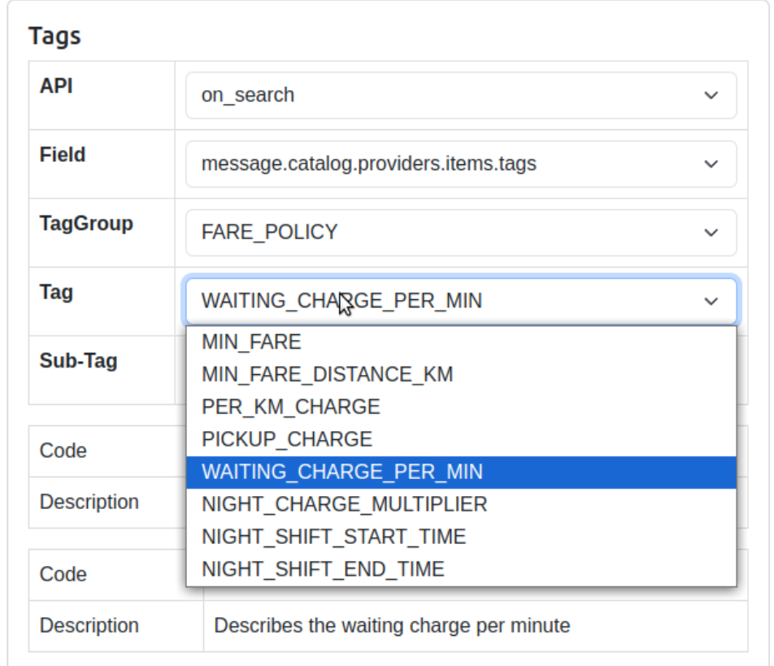
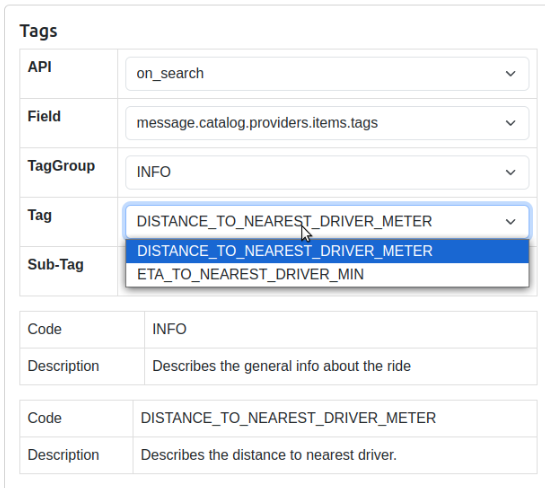

### `FARE_POLICY` tags:

`FARE_POLICY` tags in `on_search` are used to build fare breakups and details for display. They are not flow-critical for BAP business logic; missing tags degrade UX (less detailed price info) but do not block the flow.

Group code: "`FARE_POLICY`"
JSON path (`on_search`): `message.catalog.providers.items.tags`

- `MIN_FARE` ✅ **Compliant**
  - Used by: getBaseFare → `EstimateInfo`/`QuoteInfo` (breakup rows)
- `PER_HOUR_CHARGE` ❌ **Not compliant** ONDC: not found
  - Used by: getPerHourCharge → Rental/InterCity details + breakup
- `PER_MINUTE_CHARGE` ❌ **Not compliant** ONDC: not found
  - Used by: `getPerExtraMinRate` → Rental/InterCity details + breakup
- `UNPLANNED_PER_KM_CHARGE` ❌ **Not compliant** ONDC: not found
  - Used by: `getPerExtraKmRate` → Rental/InterCity details + breakup
- `PER_HOUR_DISTANCE_KM` ❌ **Not compliant** ONDC: not found
  - Used by: `getIncludedKmPerHr` → Rental/InterCity details
- `PLANNED_PER_KM_CHARGE` ❌ **Not compliant** ONDC: `PER_KM_CHARGE`
  - Used by: `getPlannedPerKmRate` → Rental/InterCity one‑way breakup
- `PLANNED_PER_KM_CHARGE_ROUND_TRIP` ❌ **Not compliant** ONDC: not found
  - Used by: `getPlannedPerKmRateRoundTrip` → InterCity round‑trip breakup
- `PER_DAY_MAX_HOUR_ALLOWANCE` ❌ **Not compliant** ONDC: not found
  - Used by: `getPerDayMaxHourAllowance` → InterCity details
- `PER_DAY_MAX_ALLOWANCE_IN_MINS` ❌ **Not compliant** ONDC: not found
  - Used by: `getPerDayMaxAllowanceInMins` → InterCity details
- `DEAD_KILOMETER_FARE` ❌ **Not compliant** ONDC: `PICKUP_CHARGE`
  - Used by: `getDeadKilometerFare` → Rental/InterCity details + breakup
- `NIGHT_SHIFT_CHARGE` ❌ **Not compliant** ONDC: not found / `NIGHT_CHARGE_MULTIPLIER` ✅ **Compliant**
  - Used by: `getNightShiftCharge` (+ `getOldNightShiftCharge`) → `NightShiftInfo`
- `NIGHT_SHIFT_START_TIME` ✅ **Compliant** / `NIGHT_SHIFT_END_TIME` ✅ **Compliant**
  - Used by: `getNightShiftStart` / `getNightShiftEnd` → `NightShiftInfo`
- `WAITING_CHARGE_PER_MIN` ✅ **Compliant**
  - Used by: `buildWaitingChargeInfo`' → `WaitingChargesInfo`
- `TOLL_CHARGES` ❌ **Not compliant** ONDC: not found
  - Used by: `getTollCharges` → `TollChargesInfo`

- `BASE_FARE` ❌ **Not compliant** ONDC: not found
  - Used by: `getInvoice`, `mkEstimateAPIEntity`
- `SERVICE_CHARGE` ❌ **Not compliant** ONDC: not found
  - Used by: `getInvoice`
- `CONGESTION_CHARGE` ❌ **Not compliant** ONDC: not found
  - Used by: not found
- `EXTRA_TIME_FARE` ❌ **Not compliant** ONDC: not found
  - Used by: `getInvoice`
- `PARKING_CHARGE` ❌ **Not compliant** ONDC: not found
  - Used by: `getInvoice`
- `WAITING_OR_PICKUP_CHARGES` ❌ **Not compliant** ONDC: not found
  - Used by: `getInvoice`
- `FIXED_GOVERNMENT_RATE` ❌ **Not compliant** ONDC: not found
  - Used by: `getInvoice`
- `PET_CHARGES` ❌ **Not compliant** ONDC: not found
  - Used by: not found
- `PRIORITY_CHARGES` ❌ **Not compliant** ONDC: not found
  - Used by: not found
- `CARD_CHARGES_ON_FARE` ❌ **Not compliant** ONDC: not found
  - Used by: not found
- `CARD_CHARGES_FIXED` ❌ **Not compliant** ONDC: not found
  - Used by: not found

Where parsed: nammayatri/nammayatri2/Backend/app/rider-platform/rider-app/Main/src/Beckn/OnDemand/Utils/OnSearch.hs

What they feed:
- `EstimateInfo.estimateBreakupList` / `QuoteInfo.quoteBreakupList`
- `RentalQuoteDetails` / `InterCityQuoteDetails`
- `NightShiftInfo`, `WaitingChargesInfo`, `TollChargesInfo`

Impact if missing:
- Breakup lines or details are omitted or defaulted; price still taken from item.price fields; `on_search` → `onSearch` flow continues.

Status
- Listed all FARE_POLICY tags consumed in `on_search`, mapped to parsing functions and data they populate. Confirmed they are informational (UX/transparency), not flow-critical.

### INFO tags:

Group code: "`INFO`"
JSON path (`on_search`): `message.catalog.providers.items.tags`

- `SPECIAL_LOCATION_TAG` ❌ **Not compliant** ONDC: not found
  - Parsed by: `buildSpecialLocationTag`
  - Used in: `EstimateInfo.specialLocationTag`, `QuoteInfo.specialLocationTag`
  - Purpose: UI label; non-blocking

- `SPECIAL_LOCATION_NAME` ❌ **Not compliant** ONDC: not found
  - Parsed by: `getSpecialLocationName`
  - Used in: `EstimateInfo.specialLocationName`, `QuoteInfo.specialLocationName`
  - Purpose: UI label; non-blocking

- `DISTANCE_TO_NEAREST_DRIVER_METER` ✅ **Compliant**
  - Parsed by: not consumed on rider `OnSearch` path (currently generated only)
  - Used in: UI/analytics; non-blocking

- `DURATION_TO_NEAREST_DRIVER_MINUTES` ☑️ **Made compliant** ONDC: `ETA_TO_NEAREST_DRIVER_MIN`
  - Parsed by: `getestimatedPickupDuration`
  - Used in: `EstimateInfo.estimatedPickupDuration`, `QuoteInfo.estimatedPickupDuration`
  - Purpose: ETA to nearest driver; non-blocking

- `IS_CUSTOMER_PREFFERED_SEARCH_ROUTE` ❌ **Not compliant** ONDC: not found
  - Parsed by: `getIsCustomerPrefferedSearchRoute`
  - Used in: `EstimateInfo.isCustomerPrefferedSearchRoute`, `QuoteInfo.isCustomerPrefferedSearchRoute`
  - Purpose: route flag; non-blocking

- `IS_BLOCKED_SEARCH_ROUTE` ❌ **Not compliant** ONDC: not found
  - Parsed by: `getIsBlockedRoute`
  - Used in: `EstimateInfo.isBlockedRoute`, `QuoteInfo.isBlockedRoute`
  - Purpose: route flag; non-blocking

- `TOLL_NAMES` ❌ **Not compliant** ONDC: not found
  - Parsed by: `getTollNames`
  - Used in: `TollChargesInfo.tollNames` inside `EstimateInfo/QuoteInfo`
  - Purpose: fare context; non-blocking

- TIP_OPTIONS ❌ **Not compliant** ONDC: not found
  - Parsed by: `getTipOptions`
  - Used in: `EstimateInfo.tipOptions`
  - Purpose: tipping UX; non-blocking

- `SMART_TIP_SUGGESTION` ❌ **Not compliant** ONDC: not found
  - Parsed by: `getSmartTipSuggestion`
  - Used in: `EstimateInfo.smartTipSuggestion`
  - Purpose: tipping UX; non-blocking

- `SMART_TIP_REASON` ❌ **Not compliant** ONDC: not found
  - Parsed by: `getSmartTipReason`
  - Used in: `EstimateInfo.smartTipReason`
  - Purpose: tipping UX; non-blocking

### `VEHICLE_INFO` tags:

Group code: "`VEHICLE_INFO`"
JSON path (`on_search`): `message.catalog.providers.items.tags`

- `VEHICLE_ICON_URL` ❌ **Not compliant** ONDC: not found
  - Parsed by: `getVehicleIconUrl`
  - Used in: `EstimateInfo.vehicleIconUrl`
  - Purpose: tipping UX; non-blocking

JSON path (`on_search`): `message.catalog.providers.fulfillment.tags`

- `IS_AIR_CONDITIONED` ❌ **Not compliant** ONDC: not found
  - Parsed by: `getVehicleServiceTierAirConditioned`
  - Used in: `EstimateInfo.vehicleServiceTierAirConditioned`
  - Purpose: tipping UX; non-blocking

- `IS_AIR_CONDITIONED_VEHICLE` ❌ **Not compliant** ONDC: not found
  - Parsed by: `getIsAirConditioned`
  - Used in:
  - Purpose: tipping UX; non-blocking

### `BUYER_FINDER_FEES` tags:
provider.payments.tags `BUYER_FINDER_FEES`

- `BUYER_FINDER_FEES_PERCENTAGE` ☑️ **Made compliant** ONDC: tagGropup: `BPP_TERMS` `message.catalog.tags`
  - Parsed by:
  - Used in:
  - Purpose: tipping UX; non-blocking

### SETTLEMENT_TERM tags:
provider.payments.tags `SETTLEMENT_TERMS`

- `SETTLEMENT_WINDOW` ☑️ **Made compliant** ONDC: tagGropup: `BPP_TERMS` `message.catalog.tags`
  - Parsed by:
  - Used in:
  - Purpose: tipping UX; non-blocking

- `SETTLEMENT_TYPE/BASIS` ☑️ **Made compliant**  ONDC: tagGropup: `BPP_TERMS` tag: `SETTLEMENT_TYPE`, `SETTLEMENT_BASIS` `message.catalog.tags`
  - Parsed by:
  - Used in:
  - Purpose: tipping UX; non-blocking

- `MANDATORY_ARBITRATION` ☑️ **Made compliant** ONDC: tagGropup: `BPP_TERMS` m`essage.catalog.tags`
  - Parsed by:
  - Used in:
  - Purpose: tipping UX; non-blocking

- `COURT_JURISDICTION` ☑️ **Made compliant** ONDC: tagGropup: `BPP_TERMS` `message.catalog.tags`
  - Parsed by:
  - Used in:
  - Purpose: tipping UX; non-blocking

- `DELAY_INTEREST` ☑️ **Made compliant** ONDC: tagGropup: `BPP_TERMS` `message.catalog.tags`
  - Parsed by:
  - Used in:
  - Purpose: tipping UX; non-blocking

- `STATIC_TERMS` ☑️ **Made compliant** ONDC: tagGropup: `BPP_TERMS` `message.catalog.tags`
  - Parsed by:
  - Used in:
  - Purpose: tipping UX; non-blocking

All `INFO` tags are informational/UX; they do not drive core BAP business logic or block the flow.
