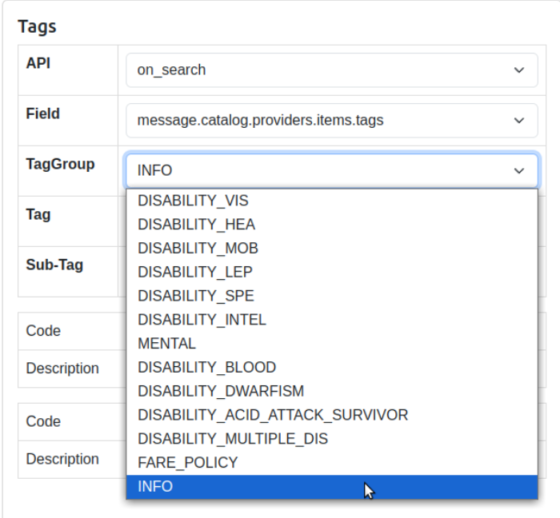

### `SEARCH` tags:

All below tags group did not found in ONDC spec

- GROUP: `ROUTE_INFO`
  - `DISTANCE_INFO_IN_M` ❌ **Not compliant** ONDC: not found
    - Parsed by: `getDistance`
    - Maps to: `DSearchReq.routeDistance`
    - JSON: `message.intent.fulfillment.tags`
    - Criticality: Important for pricing; falls back to maps/0 if absent
  - `DURATION_INFO_IN_S` ❌ **Not compliant** ONDC: not found
    - Parsed by: `getDuration`
    - Maps to: `DSearchReq.routeDuration`
    - JSON: `message.intent.fulfillment.tags`
    - Criticality: Important for pricing; falls back to maps/0 if absent
  - `RETURN_TIME` ❌ **Not compliant** ONDC: not found
    - Parsed by: `getReturnTime`
    - Maps to: `DSearchReq.returnTime`
    - JSON: `message.intent.fulfillment.tags`
    - Criticality: Optional
  - `ROUND_TRIP` ❌ **Not compliant** ONDC: not found
    - Parsed by: `getRoundTrip`
    - Maps to: `DSearchReq.roundTrip`
    - JSON: `message.intent.fulfillment.tags`
    - Criticality: Important for pricing behavior
  - `WAYPOINTS` ❌ **Not compliant** ONDC: not found
    - Parsed by: `buildRoutePoints`
    - Maps to: `DSearchReq.routePoints`
    - JSON: `message.intent.fulfillment.tags`
    - Criticality: If present with distance/duration, we trust BAP’s route (but still validate serviceability)
  - `MULTIPLE_ROUTES` ❌ **Not compliant** ONDC: not found
    - Parsed by: `buildMultipleRoutesTag`
    - Maps to: `DSearchReq.multipleRoutes`
    - JSON: `message.intent.fulfillment.tags`
    - Criticality: Optional; used in route serviceability

- GROUP: `REALLOCATION_INFO`
  - `IS_REALLOCATION_ENABLED` ❌ **Not compliant** ONDC: not found
    - Parsed by: `getIsReallocationEnabled`
    - Maps to: `DSearchReq.isReallocationEnabled`
    - JSON: `message.intent.fulfillment.tags`
    - Criticality: Optional feature flag

- GROUP: `SEARCH_REQUEST_INFO`
  - `IS_METER_RIDE_SEARCH` ❌ **Not compliant** ONDC: not found
    - Parsed by: `getIsMeterRideSearch`
    - Maps to: `DSearchReq.isMeterRideSearch`
    - JSON: `message.intent.fulfillment.tags`
    - Criticality: Affects trip category/pricing path
  - `IS_MULTIMODAL_SEARCH` ❌ **Not compliant** ONDC: not found
    - Parsed by: `getIsMultimodalSearch`
    - Maps to: `DSearchReq.isMultimodalSearch`
    - JSON: `message.intent.fulfillment.tags`
    - Criticality: Optional; changes expiry and downstream behavior
  - `RESERVED_RIDE_TAG` ❌ **Not compliant** ONDC: not found
    - Parsed by: `getIsReserveRide` (in `Transformer/Search.hs`)
    - Maps to: `DSearchReq.isReserveRide`
    - JSON: `message.intent.fulfillment.tags`
    - Criticality: Optional; reserved flow
  - `RESERVED_PRICING_TAG` ❌ **Not compliant** ONDC: not found
    - Parsed by: `getReserveRideEstimate` (in `Transformer/Search.hs`)
    - Maps to: `DSearchReq.reserveRideEstimate`
    - JSON: `message.intent.fulfillment.tags`
    - Criticality: Optional; reserved flow pricing

- GROUP: `FARE_PARAMETERS_IN_RATECARD_INFO`
  - `FARE_PARAMETERS_IN_RATECARD` ❌ **Not compliant** ONDC: not found
    - Parsed by: `fareParametersInRateCard`
    - Maps to: `DSearchReq.fareParametersInRateCard`
    - JSON: `message.intent.fulfillment.tags`
    - Criticality: Optional toggle

- GROUP: `DRIVER_IDENTIFIER`
  - `DRIVER_IDENTITY` ❌ **Not compliant** ONDC: not found
    - Parsed by: `getDriverIdentifier`
    - Maps to: `DSearchReq.driverIdentifier`
    - JSON: `message.intent.fulfillment.tags`
    - Criticality: Optional (targeted search)

- GROUP: `CUSTOMER_INFO` (under customer.person.tags)
  - `CUSTOMER_LANGUAGE` ☑️  **Made compliant**  json field `fulfillment.customer.person.languages` 
    - Parsed by: `buildCustomerLanguage`
    - Maps to: DSearchReq.customerLanguage
    - JSON: `message.intent.fulfillment.customer.person.tags`
    - Criticality: Optional (UX)
  - `CUSTOMER_NAMMA_TAGS` ❌ **Not compliant** ONDC: not found
    - Parsed by: `buildCustomerNammaTags`
    - Maps to: `DSearchReq.customerNammaTags`
    - JSON: `message.intent.fulfillment.customer.person.tags`
    - Criticality: Optional (analytics)
  - `DASHBOARD_USER` ❌ **Not compliant** ONDC: not found
    - Parsed by: checkIfDashboardSearch
    - Maps to: DSearchReq.isDashboardRequest
    - JSON: `message.intent.fulfillment.customer.person.tags`
    - Criticality: Optional (flags dashboard-origin)
  - `CUSTOMER_DISABILITY` ❌ **TODO:** **Not compliant** ONDC: many tags groups found 
    - Parsed by: buildDisabilityTag
    - Maps to: `DSearchReq.disabilityTag`
    - JSON: `message.intent.fulfillment.customer.person.tags`
    - Criticality: Optional (accessibility flows)
    - 
  - `CUSTOMER_PHONE_NUMBER` ✅ **Compliant**  send also init json field `fulfillment.customer.contact.phone`
    - Parsed by: `buildCustomerPhoneNumber`
    - Maps to: `DSearchReq.customerPhoneNum`
    - JSON: `message.intent.fulfillment.customer.person.tags`
    - Criticality: Optional

 ❌ **Not compliant** `message.intent.payment.tags` ONDC: `message.intent.tags` Not used on bpp side

Notes
- If `DISTANCE`/`DURATION`/`WAYPOINTS` are provided, we don’t recompute via maps; we still validate route serviceability (blocked routes).
- If missing, distance/duration are computed from maps when possible or default to 0, which may reduce pricing accuracy.
- Payment-related tags in search intent are not consumed by BPP here.

- Done
  - Compiled a concise, code-accurate mapping of `SEARCH` tags to parsing functions, destination fields in `DSearchReq`, JSON paths, and criticality.
