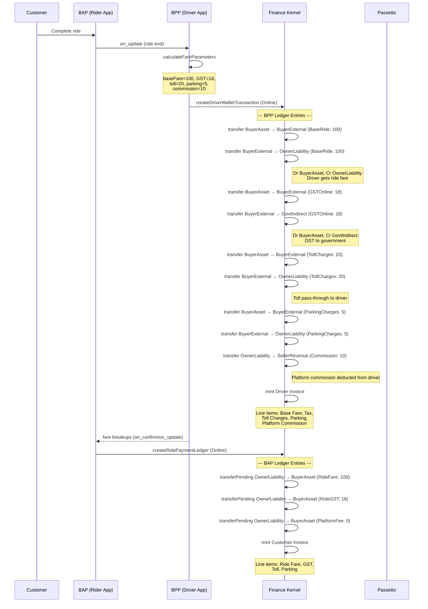
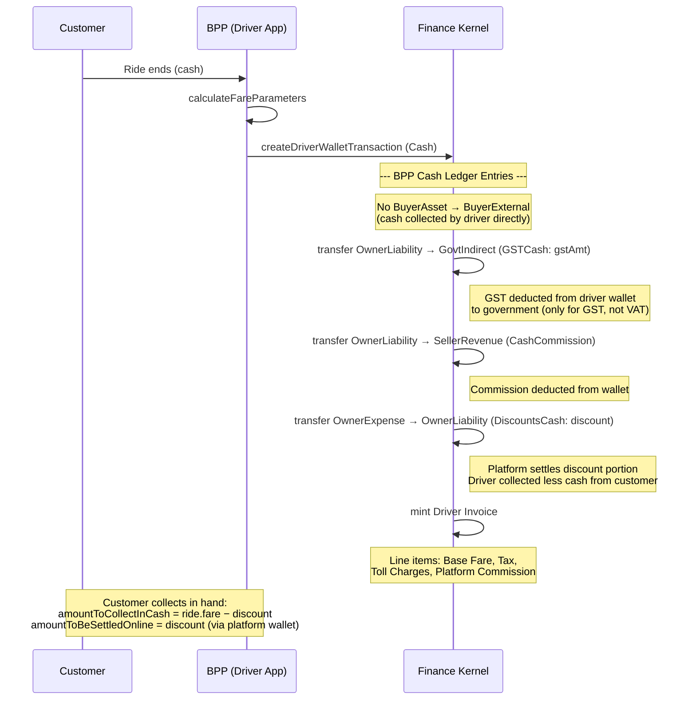
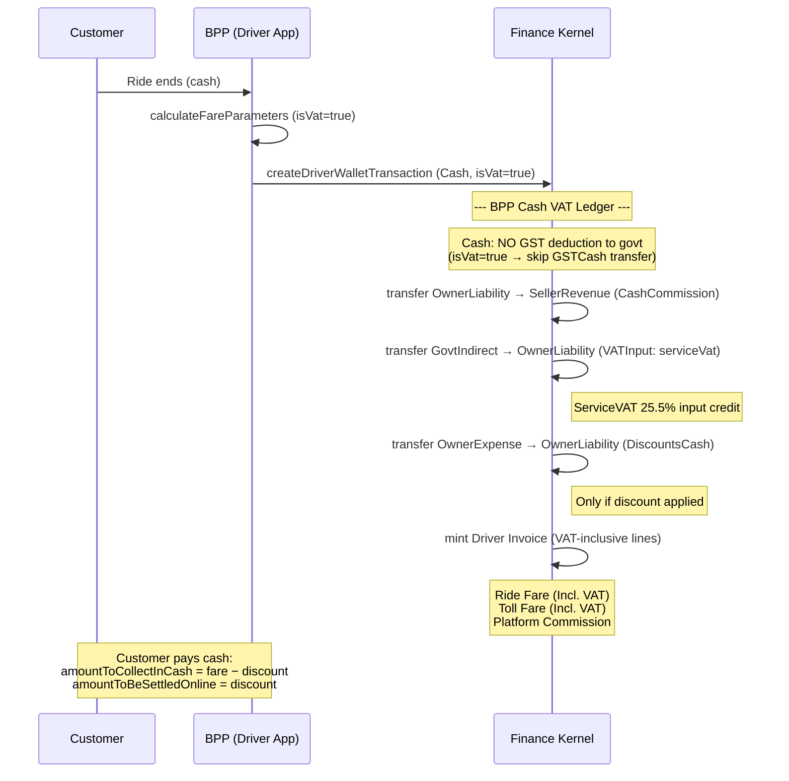
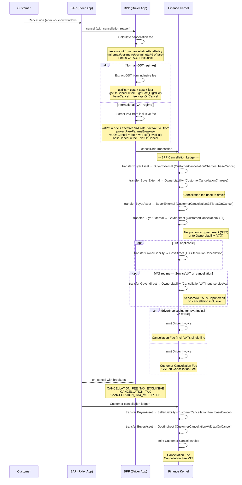
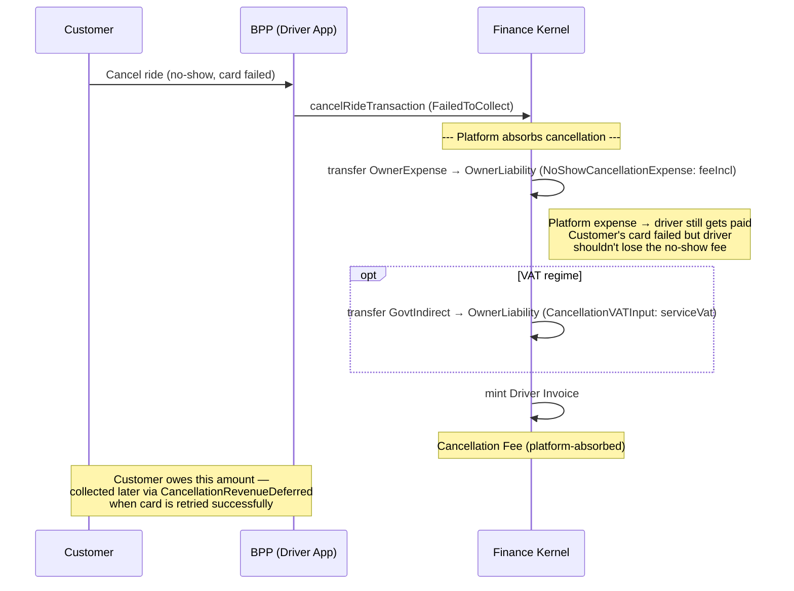
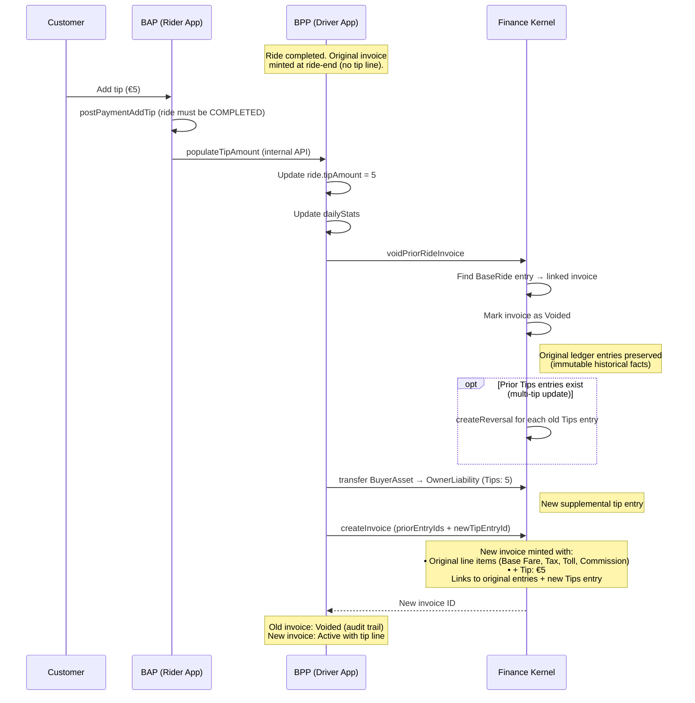

# Ledger Entry Sequence Diagrams

## 1. Normal Ride (India/GST) — Online Payment — Ride Completion

## 2. International Ride (Finland/VAT) — Online Payment — Ride Completion with Discount

```mermaid
sequenceDiagram
    participant Customer
    participant BAP as BAP (Rider App)
    participant BPP as BPP (Driver App)
    participant FK as Finance Kernel

    Customer->>BAP: Complete ride
    BAP->>BPP: on_update (ride end)

    BPP->>BPP: calculateFareParameters
    Note over BPP: Partition via vatChargeConfig.appliesOn:<br/>rideFareNoTaxApplicable=30 (exempt)<br/>rideFareTaxExclusive=50 (taxable)<br/>rideTax=6.75 (13.5%)<br/>tollFareTaxExclusive=15<br/>tollTax=2.03 (13.5%)<br/>discount=8.68 (from BAP)

    BPP->>BPP: Emit wire breakups
    Note over BPP: RIDE_FARE_NO_TAX_APPLICABLE=30<br/>RIDE_FARE_TAX_EXCLUSIVE=50<br/>RIDE_TAX=6.75<br/>TOLL_FARE_TAX_EXCLUSIVE=15<br/>TOLL_TAX=2.03<br/>+ RIDE_TAX_MULTIPLIER=1.135<br/>+ TOLL_TAX_MULTIPLIER=1.135

    BPP->>FK: createDriverWalletTransaction (Online, isVat=true)
    Note over FK: --- BPP Ledger Entries (VAT) ---

    rect rgb(40, 60, 80)
        Note over FK: baseFarePostDiscount = baseFare - discount
        FK->>FK: transfer BuyerAsset → BuyerExternal (BaseRide: postDiscountAmt)
        FK->>FK: transfer BuyerExternal → OwnerLiability (BaseRide)
        Note right of FK: Post-discount ride fare to driver

        FK->>FK: transfer BuyerAsset → BuyerExternal (VATOnline: taxAmt)
        FK->>FK: transfer BuyerExternal → OwnerLiability (VATOnline)
        Note right of FK: VAT stays with driver (not govt)<br/>because isVat=true

        FK->>FK: transfer BuyerAsset → BuyerExternal (TollCharges: tollInclVat)
        FK->>FK: transfer BuyerExternal → OwnerLiability (TollCharges)
    end

    FK->>FK: transfer OwnerLiability → SellerRevenue (Commission)
    Note right of FK: Commission on rideFareTaxExcl +<br/>rideTax + rideFareNoTaxApplicable

    FK->>FK: transfer GovtIndirect → OwnerLiability (VATInput: serviceVat)
    Note right of FK: ServiceVAT 25.5% input credit<br/>on pre-discount ride inclusive

    FK->>FK: transfer OwnerExpense → OwnerLiability (DiscountsOnline: discount)
    Note right of FK: Platform absorbs discount<br/>Driver gets paid full pre-discount

    FK->>FK: mint Driver Invoice
    Note over FK: driverInvoiceLineItemsVatInclusive=true:<br/>Ride Fare (Incl. VAT)<br/>Toll Fare (Incl. VAT)<br/>Parking Charges<br/>Platform Commission

    BPP-->>BAP: breakups + MULTIPLIER tags

    BAP->>BAP: calculateFareParameters (pure)
    Note over BAP: Proportional discount allocation:<br/>ratio = postDiscountIncl / rideTotalIncl<br/>newRideTax = taxableIncl × (m-1)/m<br/>where m = rideTaxMultiplier (1.135)

    BAP->>FK: Customer ledger entries
    FK->>FK: transfer BuyerAsset → SellerLiability (CustomerRideFare)
    FK->>FK: transfer BuyerAsset → GovtIndirect (CustomerRideVAT)
    FK->>FK: transfer BuyerAsset → SellerLiability (CustomerTollCharges)
    FK->>FK: transfer SellerLiability → BuyerAsset (CustomerDiscount)
    FK->>FK: mint Customer Invoice
    Note over FK: Ride Fare (Excl. VAT)<br/>Discount: −8.68<br/>Ride VAT (13.5% post-recompute)<br/>Toll Fare (Incl. VAT)
```

## 3. Normal Ride (India/GST) — Cash Payment — Ride Completion with Discount

## 4. International Ride (Finland/VAT) — Cash Payment — Ride Completion

## 5. Customer Cancellation with No-Show Charges — Online Payment

## 6. Customer Cancellation — No-Show Charges Failed to Collect (Card declined)

## 7. Post-Ride Tip Flow — Invoice Regeneration

## Ledger Account Summary

| Account Role     | Counterparty        | Type      | Used For                                                |
| ---------------- | ------------------- | --------- | ------------------------------------------------------- |
| `BuyerAsset`     | BUYER (merchant)    | Asset     | Customer payment pool (online)                          |
| `BuyerExternal`  | BUYER (merchant)    | External  | Settlement intermediary                                 |
| `OwnerLiability` | Driver/Fleet        | Liability | Driver wallet / payable                                 |
| `OwnerExpense`   | Driver/Fleet        | Expense   | Platform-absorbed costs (discounts, failed collections) |
| `GovtIndirect`   | GOVERNMENT_INDIRECT | Liability | GST/VAT payable to government                           |
| `GovtDirect`     | GOVERNMENT_DIRECT   | Liability | TDS payable to government                               |
| `SellerRevenue`  | SELLER (platform)   | Revenue   | Platform commission income                              |
| `PlatformAsset`  | SELLER (platform)   | Asset     | Wallet topup source                                     |

## Reference Type Summary

| Reference Type                | When Used                    | Direction                                               |
| ----------------------------- | ---------------------------- | ------------------------------------------------------- |
| `BaseRide`                    | Ride-end                     | BuyerAsset → OwnerLiability                             |
| `GSTOnline` / `VATOnline`     | Ride-end (online)            | BuyerAsset → GovtIndirect (GST) or OwnerLiability (VAT) |
| `GSTCash` / `VATCash`         | Ride-end (cash)              | OwnerLiability → GovtIndirect (GST only)                |
| `TollCharges`                 | Ride-end                     | BuyerAsset → OwnerLiability                             |
| `ParkingCharges`              | Ride-end                     | BuyerAsset → OwnerLiability                             |
| `Commission`                  | Ride-end                     | OwnerLiability → SellerRevenue                          |
| `VATInput`                    | Ride-end (VAT regime)        | GovtIndirect → OwnerLiability                           |
| `DiscountsOnline`/`DiscountsCash` | Ride-end (+ discount)    | OwnerExpense → OwnerLiability                           |
| `VATAbsorbedOnDiscount`       | Ride-end (VAT + discount)    | OwnerExpense → OwnerLiability                           |
| `Tips`                        | Post-ride tip                | BuyerAsset → OwnerLiability                             |
| `CustomerCancellationCharges` | Cancellation                 | BuyerAsset → OwnerLiability                             |
| `CustomerCancellationGST`     | Cancellation                 | BuyerAsset → GovtIndirect                               |
| `CancellationVATInput`        | Cancellation (VAT)           | GovtIndirect → OwnerLiability                           |
| `NoShowCancellation`          | Cancel (card collected)      | BuyerAsset → OwnerLiability                             |
| `NoShowCancellationExpense`   | Cancel (card failed)         | OwnerExpense → OwnerLiability                           |
| `TDSDeductionOnline`          | Ride-end (TDS)               | OwnerLiability → GovtDirect                             |
| `TDSDeductionCash`            | Ride-end (TDS)               | OwnerLiability → GovtDirect                             |
| `TDSDeductionCancellation`    | Cancellation (TDS)           | OwnerLiability → GovtDirect                             |
