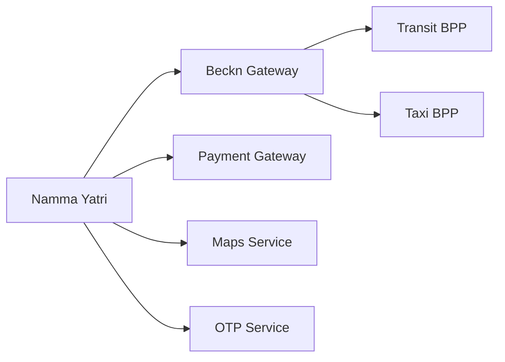

# Multimodal Journey System - Architecture Overview

## Table of Contents
1. [System Overview](#system-overview)
2. [Key Components](#key-components)
3. [Design Patterns](#design-patterns)
4. [Technical Decisions](#technical-decisions)
5. [Integration Patterns](#integration-patterns)

## System Overview

The Namma Yatri multimodal journey system is a sophisticated transportation orchestration platform that enables users to plan and execute journeys using multiple transportation modes (taxi, metro, bus, subway, walking) in a single trip.

## Key Components

```
┌─────────────────────────────────────────────────────────────────┐
│                    Multimodal Journey System                     │
├─────────────────────────────────────────────────────────────────┤
│  MultimodalConfirm.hs - Main API Controller                     │
│  ├── Journey Initiation & Confirmation                          │
│  ├── Booking Management                                          │
│  ├── Payment Handling                                            │
│  └── Status Updates & Feedback                                   │
├─────────────────────────────────────────────────────────────────┤
│  JourneyModule/                                                  │
│  ├── Base.hs - Core Journey Orchestration                       │
│  ├── Types.hs - Data Structures & Type Classes                  │
│  ├── Utils.hs - Utility Functions                               │
│  └── Location.hs - Location Management                          │
├─────────────────────────────────────────────────────────────────┤
│  JourneyLeg/                                                     │
│  ├── Interface.hs - Common Leg Operations                       │
│  ├── Types.hs - Leg Status & Data Types                         │
│  ├── Taxi.hs - Taxi Leg Implementation                          │
│  ├── Metro.hs - Metro Leg Implementation                        │
│  ├── Bus.hs - Bus Leg Implementation                            │
│  ├── Subway.hs - Subway Leg Implementation                      │
│  └── Walk.hs - Walking Leg Implementation                       │
└─────────────────────────────────────────────────────────────────┘
```

## Design Patterns

### 1. **Type Class Pattern for Journey Legs**
```haskell
class JourneyLeg leg m where
  search :: SearchJourneyLeg leg m
  confirm :: ConfirmJourneyLeg leg m
  update :: UpdateJourneyLeg leg m
  cancel :: CancelJourneyLeg leg m
  isCancellable :: IsCancellableJourneyLeg leg m
  getState :: GetJourneyLegState leg m
  getInfo :: GetJourneyLeg leg m
  getFare :: GetFareJourneyLeg leg m
```
**Benefits**:
- Polymorphic behavior for different transport modes
- Consistent interface across all leg types
- Easy to extend with new transport modes
- Type safety at compile time

### 2. **Command Pattern for Leg Operations**
```haskell
data TaxiLegRequest
  = TaxiLegRequestSearch TaxiLegRequestSearchData
  | TaxiLegRequestConfirm TaxiLegRequestConfirmData
  | TaxiLegRequestCancel TaxiLegRequestCancelData
  | TaxiLegRequestGetInfo TaxiLegRequestGetInfoData
  -- ... other operations
```
**Benefits**:
- Encapsulates operation parameters
- Enables operation queuing and logging
- Clean separation of concerns
- Easy to add new operations

### 3. **State Machine Pattern for Status Management**
The system implements explicit state machines for both journey and leg statuses, ensuring valid state transitions and preventing invalid operations.

### 4. **Strategy Pattern for User Preferences**
```haskell
data MultimodalUserPreferences = MultimodalUserPreferences
  { allowedTransitModes :: [MultimodalTravelMode]
  , journeyOptionsSortingType :: Maybe JourneyOptionsSortingType
  , busTransitTypes :: Maybe [ServiceTierType]
  , subwayTransitTypes :: Maybe [ServiceTierType]
  }
```

## Technical Decisions

### 1. **Asynchronous Journey Execution**
- Uses `fork` for non-blocking journey initiation
- Implements retry mechanisms with `withShortRetry`
- Enables real-time status updates without blocking user operations

### 2. **Redis-based Locking**
```haskell
lockKey = "infoLock-" <> journeyId.getId
Redis.withLockRedisAndReturnValue lockKey 60 $ do
  -- Critical section operations
```
**Purpose**:
- Prevents race conditions during journey updates
- Ensures data consistency across concurrent operations
- Handles distributed system challenges

### 3. **Graceful Degradation**
```haskell
if riderConfig.multimodalTesting
  then do
    -- Always create journey leg (testing mode)
  else case mbTotalLegFare of
    Just fare -> -- Create leg with fare
    Nothing -> return (Nothing, Nothing) -- Skip leg
```

### 4. **Extensible Leg Extra Info**
```haskell
data LegExtraInfo
  = Walk WalkLegExtraInfo
  | Taxi TaxiLegExtraInfo
  | Metro MetroLegExtraInfo
  | Bus BusLegExtraInfo
  | Subway SubwayLegExtraInfo
```
**Benefits**:
- Type-safe mode-specific data storage
- Easy to extend with new transport modes
- Compile-time validation of mode-specific operations

## Integration Patterns

### 1. **External Service Integration**


### 2. **Event-Driven Architecture**
- Journey state changes trigger events
- Async processing for non-critical operations
- Event sourcing for audit trails

### 3. **CQRS Pattern**
- Separate read/write models for journey data
- Optimized queries for real-time status
- Write optimization for booking operations

## Performance Optimizations

### 1. **Lazy Loading & Caching**
- Journey legs are loaded on-demand
- Station and route data cached for quick lookup
- User preferences cached to reduce database hits

### 2. **Batch Operations**
- Multiple leg operations batched together
- Bulk status updates for efficiency
- Transaction boundaries for consistency

### 3. **Real-time Updates**
- WebSocket-based status streaming
- Location-based trigger optimization
- Smart polling for external service states

## Scalability Considerations

### 1. **Horizontal Scaling**
- Stateless API design enables load balancing
- Database sharding by merchant/city
- Redis clustering for distributed locking

### 2. **Microservice Integration**
- Clean interfaces with external BPP (Beckn Protocol Partners)
- Circuit breaker patterns for external service failures
- Timeout and retry configurations

### 3. **Data Partitioning**
- Journey data partitioned by time and geography
- Efficient indexing strategies for real-time queries
- Archive strategies for completed journeys

## Security & Reliability

### 1. **Data Validation**
- Comprehensive input validation at API boundaries
- Type system prevents many runtime errors
- Business rule validation in domain layer

### 2. **Error Recovery**
- Retry mechanisms for transient failures
- Fallback strategies for external service outages
- Graceful degradation modes

### 3. **Audit & Monitoring**
- Comprehensive logging at all levels
- Journey state transition logging
- Performance metrics and alerting