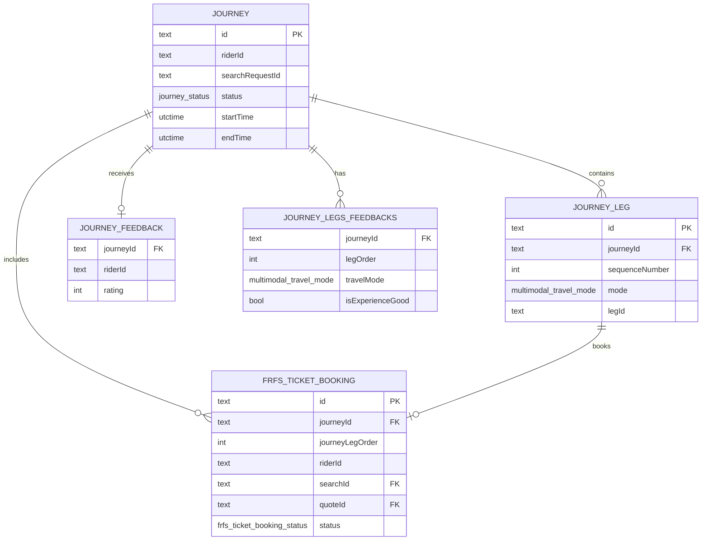

# Multimodal Journey System - Database Structure

## Overview

The multimodal journey system uses a relational database structure designed to handle complex transportation scenarios across multiple modes (taxi, metro, bus, subway, walking). The database is built using the Beam framework in Haskell.

## Core Tables

### 1. Journey Table (`journey`)

**Purpose**: Main journey orchestration record
**Primary Key**: `id` (Text)

| Column | Type | Description |
|--------|------|-------------|
| `id` | Text | Unique journey identifier |
| `riderId` | Text | User who initiated the journey |
| `searchRequestId` | Text | Original search request |
| `status` | JourneyStatus | Current journey state (INITIATED, CONFIRMED, INPROGRESS, etc.) |
| `startTime` | UTCTime? | Planned journey start time |
| `endTime` | UTCTime? | Planned journey end time |
| `estimatedDistance` | HighPrecDistance | Total estimated distance |
| `estimatedDuration` | Seconds? | Total estimated duration |
| `modes` | [MultimodalTravelMode] | List of transport modes used |
| `totalLegs` | Int | Number of journey segments |
| `convenienceCost` | Int | Additional convenience charges |
| `isPaymentSuccess` | Bool? | Payment completion status |
| `isPublicTransportIncluded` | Bool? | Whether journey includes transit |
| `journeyExpiryTime` | UTCTime? | When journey expires |
| `paymentOrderShortId` | Text? | Payment reference |
| `fromLocationAddress` | Text? | Source address |
| `toLocationAddress` | Text? | Destination address |
| `recentLocationId` | Text? | Recent location reference |
| `relevanceScore` | Double? | Journey ranking score |
| `hasPreferredServiceTier` | Bool? | User preference match |
| `hasPreferredTransitModes` | Bool? | User preference match |
| `merchantId` | Text? | Merchant identifier |
| `merchantOperatingCityId` | Text? | Operating city |
| `createdAt` | UTCTime | Record creation time |
| `updatedAt` | UTCTime | Last update time |

**Indexes**:
- Primary: `id`
- Secondary: `riderId`, `searchRequestId`

---

### 2. Journey Leg Table (`journey_leg`)

**Purpose**: Individual segments of a multimodal journey
**Primary Key**: `id` (Text)

| Column | Type | Description |
|--------|------|-------------|
| `id` | Text | Unique leg identifier |
| `journeyId` | Text | Parent journey reference |
| `sequenceNumber` | Int | Order in journey (1, 2, 3...) |
| `mode` | MultimodalTravelMode | Transport type (Taxi, Metro, Bus, etc.) |
| `legId` | Text? | Search/booking identifier |
| `startLocationLat` | Double | Start latitude |
| `startLocationLon` | Double | Start longitude |
| `endLocationLat` | Double | End latitude |
| `endLocationLon` | Double | End longitude |
| `distance` | HighPrecDistance? | Leg distance |
| `duration` | Seconds? | Leg duration |
| `estimatedMinFare` | HighPrecMoney? | Minimum fare estimate |
| `estimatedMaxFare` | HighPrecMoney? | Maximum fare estimate |
| `fromStopCode` | Text? | Transit: Origin stop code |
| `fromStopName` | Text? | Transit: Origin stop name |
| `fromStopGtfsId` | Text? | Transit: GTFS identifier |
| `fromStopPlatformCode` | Text? | Transit: Platform number |
| `fromDepartureTime` | UTCTime? | Scheduled departure |
| `fromArrivalTime` | UTCTime? | Actual arrival at origin |
| `toStopCode` | Text? | Transit: Destination stop code |
| `toStopName` | Text? | Transit: Destination stop name |
| `toStopGtfsId` | Text? | Transit: GTFS identifier |
| `toStopPlatformCode` | Text? | Transit: Platform number |
| `toDepartureTime` | UTCTime? | Departure from destination |
| `toArrivalTime` | UTCTime? | Scheduled arrival |
| `liveVehicleAvailableServiceTypes` | [ServiceTierType]? | Available service tiers |
| `changedBusesInSequence` | [Text]? | Bus transfers |
| `finalBoardedBusNumber` | Text? | Last bus used |
| `entrance` | JSON? | Entry gate information |
| `exit` | JSON? | Exit gate information |
| `isDeleted` | Bool? | Soft delete flag |
| `distanceUnit` | DistanceUnit? | Distance measurement unit |
| `merchantId` | Text? | Merchant identifier |
| `merchantOperatingCityId` | Text? | Operating city |
| `createdAt` | UTCTime | Record creation time |
| `updatedAt` | UTCTime | Last update time |

**Indexes**:
- Primary: `id`
- Secondary: `journeyId`, `legId`

---

## FRFS (Fixed Route Fixed Schedule) Tables

### 3. FRFS Ticket Booking Table (`frfs_ticket_booking`)

**Purpose**: Transit ticket bookings (metro, bus, subway)
**Primary Key**: `id` (Text)

| Column | Type | Description |
|--------|------|-------------|
| `id` | Text | Unique booking identifier |
| `journeyId` | Text? | Associated journey |
| `journeyLegOrder` | Int? | Leg sequence in journey |
| `journeyLegStatus` | JourneyLegStatus? | Current leg status |
| `riderId` | Text | User who booked |
| `searchId` | Text | Search request reference |
| `quoteId` | Text | Selected quote reference |
| `_type` | FRFSQuoteType | Quote type (SINGLE_JOURNEY, etc.) |
| `fromStationId` | Text | Origin station |
| `toStationId` | Text | Destination station |
| `vehicleType` | VehicleCategory | Transport type (BUS, METRO, etc.) |
| `quantity` | Int | Number of adult tickets |
| `childTicketQuantity` | Int? | Number of child tickets |
| `price` | HighPrecMoney | Total ticket price |
| `estimatedPrice` | HighPrecMoney | Initial price estimate |
| `finalPrice` | HighPrecMoney? | Final charged amount |
| `currency` | Currency? | Price currency |
| `status` | FRFSTicketBookingStatus | Booking state |
| `providerId` | Text | Transit operator ID |
| `providerName` | Text | Transit operator name |
| `providerDescription` | Text? | Service description |
| `bppItemId` | Text | BPP item identifier |
| `bppOrderId` | Text? | BPP order reference |
| `bppSubscriberId` | Text | BPP subscriber ID |
| `bppSubscriberUrl` | Text | BPP callback URL |
| `validTill` | UTCTime | Ticket expiry time |
| `startTime` | UTCTime? | Journey start time |
| `stationsJson` | Text | Route stations data |
| `routeStationsJson` | Text? | Full route information |
| `paymentTxnId` | Text? | Payment transaction ID |
| `payerVpa` | Text? | UPI payment address |
| `isBookingCancellable` | Bool? | Can be cancelled |
| `cancellationCharges` | HighPrecMoney? | Cancellation fee |
| `refundAmount` | HighPrecMoney? | Refund amount |
| `customerCancelled` | Bool | User-initiated cancellation |
| `isFareChanged` | Bool? | Price updated after booking |
| `isDeleted` | Bool? | Soft delete flag |
| `isSkipped` | Bool? | Leg was skipped |
| `discountedTickets` | Int? | Number of discounted tickets |
| `discountsJson` | Text? | Applied discounts |
| `eventDiscountAmount` | HighPrecMoney? | Event-based discount |
| `cashbackStatus` | CashbackStatus? | Cashback processing state |
| `cashbackPayoutOrderId` | Text? | Cashback payout reference |
| `partnerOrgId` | Text? | Partner organization |
| `partnerOrgTransactionId` | Text? | Partner transaction ID |
| `recentLocationId` | Text? | Recent location reference |
| `integratedBppConfigId` | Text? | BPP configuration |
| `journeyOnInitDone` | Bool? | Initialization complete |
| `googleWalletJWTUrl` | Text? | Google Wallet integration |
| `bookingAuthCode` | Text? | Authorization code |
| `bppBankAccountNumber` | Text? | BPP bank account |
| `bppBankCode` | Text? | BPP bank code |
| `bppDelayedInterest` | Int? | Delayed payment interest |
| `osType` | Text? | Client OS type |
| `osBuildVersion` | Text? | Client OS version |
| `merchantId` | Text | Merchant identifier |
| `merchantOperatingCityId` | Text | Operating city |
| `createdAt` | UTCTime | Record creation time |
| `updatedAt` | UTCTime | Last update time |

**Indexes**:
- Primary: `id`
- Secondary: `bppOrderId`, `journeyId`, `quoteId`, `riderId`, `searchId`

---

### 4. FRFS Search Table (`frfs_search`)

**Purpose**: Transit search requests
**Primary Key**: `id` (Text)

| Column | Type | Description |
|--------|------|-------------|
| `id` | Text | Unique search identifier |
| `riderId` | Text | User who searched |
| `fromStationId` | Text | Origin station |
| `toStationId` | Text | Destination station |
| `vehicleType` | VehicleCategory | Transport type |
| `journeyDate` | Day | Travel date |
| `quantity` | Int | Number of passengers |
| `routeId` | Text? | Specific route ID |
| `merchantId` | Text | Merchant identifier |
| `merchantOperatingCityId` | Text | Operating city |
| `createdAt` | UTCTime | Search timestamp |
| `updatedAt` | UTCTime | Last update time |

---

### 5. FRFS Quote Table (`frfs_quote`)

**Purpose**: Transit fare quotes
**Primary Key**: `id` (Text)

| Column | Type | Description |
|--------|------|-------------|
| `id` | Text | Unique quote identifier |
| `searchId` | Text | Associated search |
| `_type` | FRFSQuoteType | Quote type |
| `price` | Price | Adult ticket price |
| `childPrice` | Price? | Child ticket price |
| `routeId` | Text | Route identifier |
| `serviceTier` | ServiceTierType? | Service tier |
| `validTill` | UTCTime | Quote expiry |
| `stationsJson` | Text | Route stations |
| `vehicleType` | VehicleCategory | Transport type |
| `merchantId` | Text | Merchant identifier |
| `merchantOperatingCityId` | Text | Operating city |
| `createdAt` | UTCTime | Quote creation time |
| `updatedAt` | UTCTime | Last update time |

---

## Supporting Tables

### 6. Journey Feedback Table (`journey_feedback`)

**Purpose**: User feedback for completed journeys

| Column | Type | Description |
|--------|------|-------------|
| `journeyId` | Text | Journey reference |
| `riderId` | Text | User who provided feedback |
| `rating` | Int? | Overall rating (1-5) |
| `additionalFeedBack` | Text? | Comments |
| `merchantId` | Text? | Merchant identifier |
| `merchantOperatingCityId` | Text? | Operating city |
| `createdAt` | UTCTime | Feedback timestamp |
| `updatedAt` | UTCTime | Last update time |

---

### 7. Journey Legs Feedbacks Table (`journey_legs_feedbacks`)

**Purpose**: Mode-specific feedback for journey legs

| Column | Type | Description |
|--------|------|-------------|
| `journeyId` | Text | Journey reference |
| `legOrder` | Int | Leg sequence number |
| `travelMode` | MultimodalTravelMode | Transport mode |
| `isExperienceGood` | Bool | Experience rating |
| `merchantId` | Text? | Merchant identifier |
| `merchantOperatingCityId` | Text? | Operating city |
| `createdAt` | UTCTime | Feedback timestamp |
| `updatedAt` | UTCTime | Last update time |

---

### 8. Journey Route Details Table (`journey_route_details`)

**Purpose**: Detailed route information for transit legs

| Column | Type | Description |
|--------|------|-------------|
| `searchId` | Text | Search reference |
| `subLegOrder` | Int | Sub-route sequence |
| `routeCode` | Text? | Route identifier |
| `startStationCode` | Text? | Origin station code |
| `endStationCode` | Text? | Destination station code |
| `journeyStatus` | JourneyLegStatus? | Current status |
| `alternateShortNames` | [Text] | Route aliases |
| `frequency` | Seconds? | Service frequency |
| `lineColor` | Text? | Route color code |
| `lineColorCode` | Text? | Hex color code |
| `platformNumber` | Text? | Platform information |
| `routeLongName` | Text? | Full route name |
| `routeId` | Text? | GTFS route ID |
| `fromStationId` | Text? | Origin station reference |
| `toStationId` | Text? | Destination station reference |

---

### 9. Multimodal Preferences Table (`multimodal_preferences`)

**Purpose**: User transport preferences

| Column | Type | Description |
|--------|------|-------------|
| `personId` | Text | User identifier |
| `allowedTransitModes` | [MultimodalTravelMode] | Preferred transport modes |
| `journeyOptionsSortingType` | JourneyOptionsSortingType | Sorting preference |
| `busTransitTypes` | [ServiceTierType]? | Preferred bus types |
| `subwayTransitTypes` | [ServiceTierType]? | Preferred subway types |
| `merchantId` | Text? | Merchant identifier |
| `merchantOperatingCityId` | Text? | Operating city |
| `createdAt` | UTCTime | Record creation time |
| `updatedAt` | UTCTime | Last update time |

---

## Database Relationships



## Key Design Principles

### 1. **Journey-Centric Design**
- All data organized around the central `Journey` entity
- Legs are ordered sequences within a journey
- Clear parent-child relationships maintained

### 2. **Mode-Specific Flexibility**
- `journey_leg` table accommodates all transport modes
- FRFS-specific data in dedicated tables
- JSON fields for mode-specific metadata

### 3. **Audit Trail**
- All tables include `createdAt` and `updatedAt`
- Soft deletes using `isDeleted` flags
- Status tracking through dedicated enums

### 4. **Multi-tenancy Support**
- `merchantId` and `merchantOperatingCityId` on key tables
- City-specific configurations and pricing
- Scalable across different markets

## Performance Considerations

### Indexing Strategy
- Primary keys on all tables
- Secondary indexes on frequently queried fields (`riderId`, `journeyId`, etc.)
- Composite indexes for complex queries

### Data Partitioning
- Consider partitioning by date for large tables
- Geographic partitioning by `merchantOperatingCityId`
- Archive strategy for completed journeys

### Query Optimization
- Denormalized fields for common queries
- JSON fields for flexible schema evolution
- Efficient joins through proper foreign keys
```
</rewritten_file>