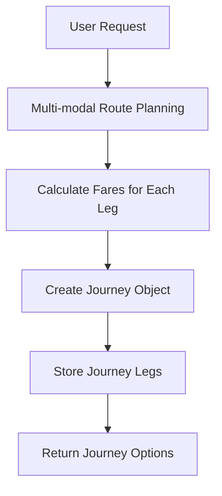
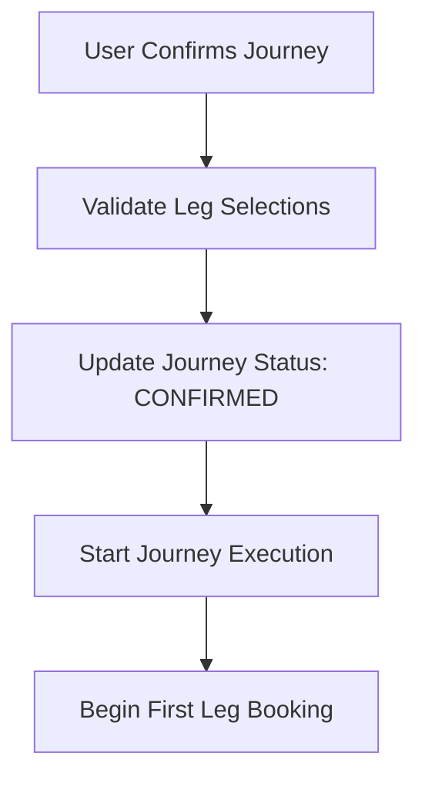
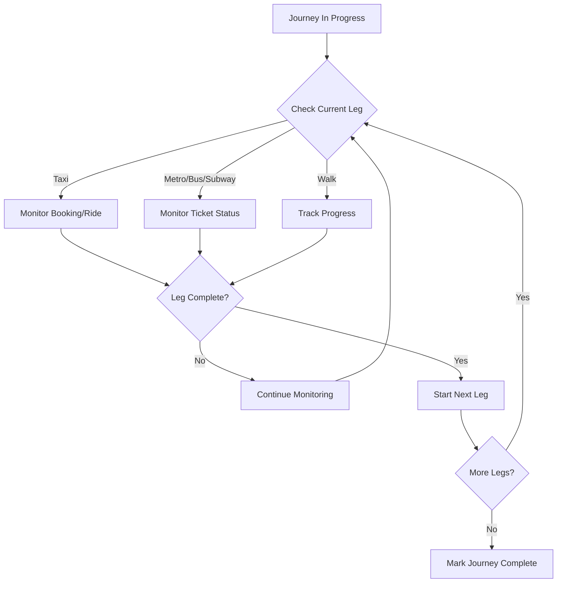
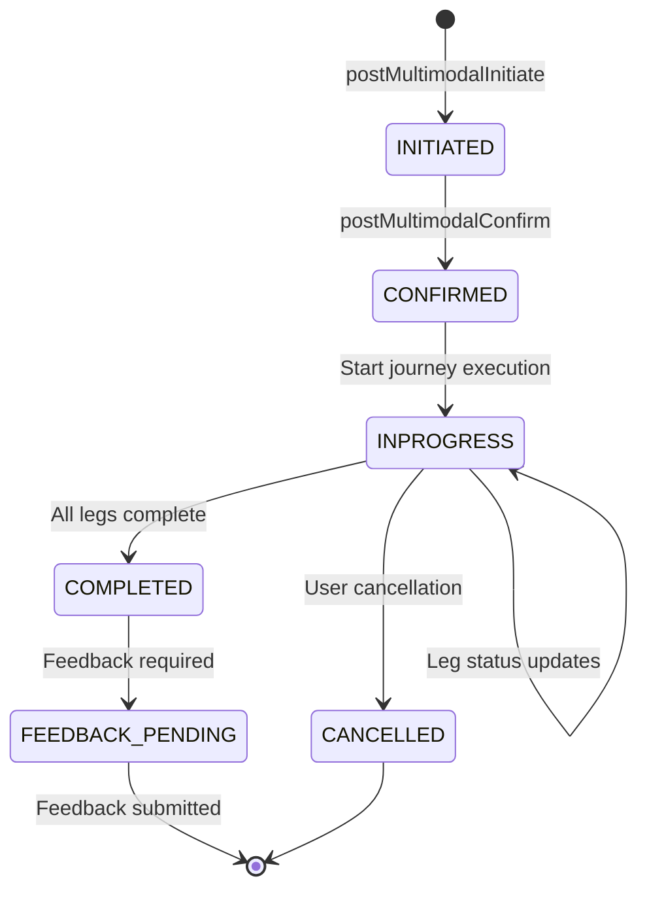
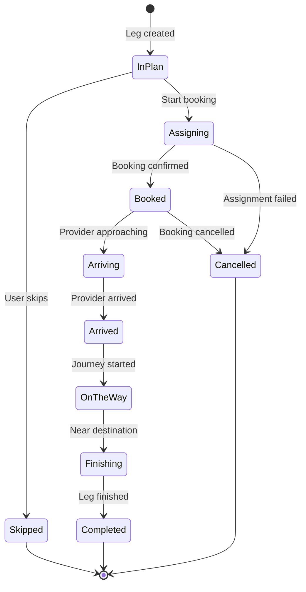
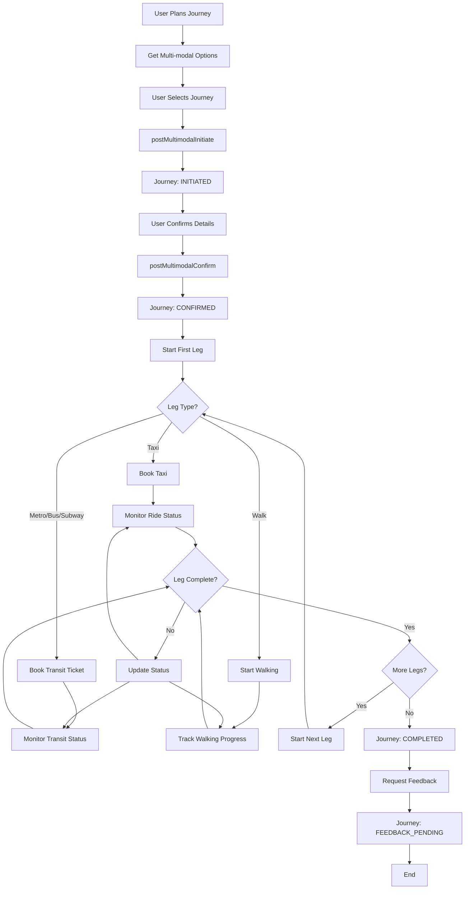
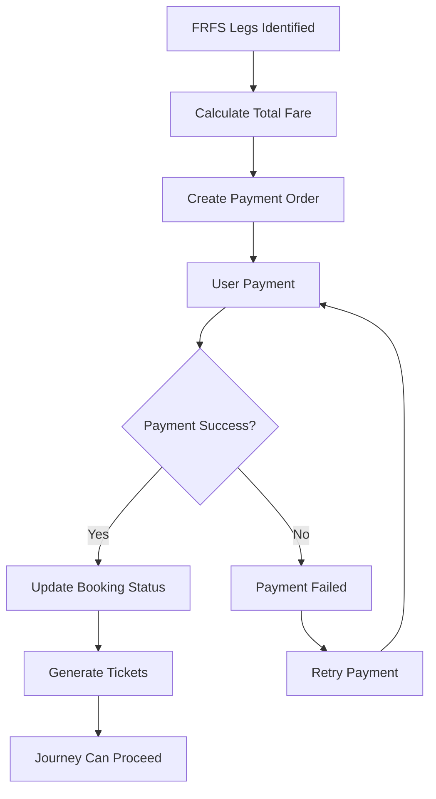
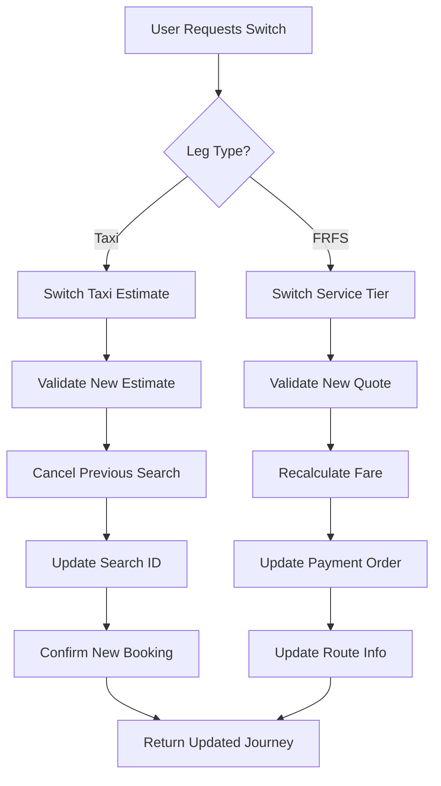
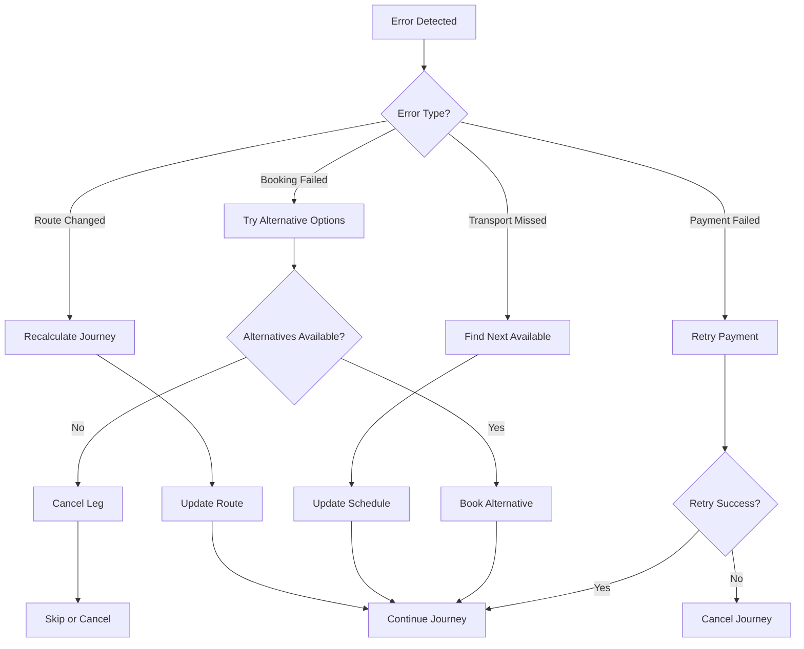

# Multimodal Journey System - Flows and State Management

## Table of Contents
1. [Journey Lifecycle](#journey-lifecycle)
2. [State Management](#state-management)
3. [Core Flow Charts](#core-flow-charts)
4. [Error Handling Flows](#error-handling-flows)
5. [Key Functions](#key-functions)

## Journey Lifecycle

### 1. Journey Planning Phase


### 2. Journey Confirmation Phase


### 3. Journey Execution Phase


## State Management

### Journey Status Flow


### Journey Leg Status Flow


### Transport Mode-Specific States

#### Taxi Leg States
- **InPlan** → **Assigning** → **Booked** → **Arrived** → **OnTheWay** → **Completed**
- Special handling for driver assignment and ride tracking

#### Metro/Bus/Subway Leg States
- **InPlan** → **Booked** → **Arriving** → **OnTheWay** → **Completed**
- QR ticket generation after booking
- Real-time vehicle tracking integration

#### Walk Leg States
- **InPlan** → **OnTheWay** → **Completed**
- GPS-based progress tracking
- No booking required

## Core Flow Charts

### Complete Journey Flow


### Payment Flow


### Leg Switching Flow


## Error Handling Flows

### Error Handling Flow


### Recovery Strategies
1. **Booking Failures**: Try alternative transport modes
2. **Payment Issues**: Retry with different payment methods
3. **Schedule Conflicts**: Find next available service
4. **Route Changes**: Recalculate optimal path
5. **System Failures**: Graceful degradation with fallbacks

## Key Functions

### 1. Journey Initialization
```haskell
init :: JourneyInitData -> MultimodalUserPreferences -> m (Maybe Journey)
```
**Process**:
- Calculates fares for each leg using `JLI.getFare`
- Creates journey legs with proper sequencing
- Validates user preferences against available options
- Stores journey and legs in database
- Returns `Nothing` if any leg fails (unless testing mode)

### 2. Journey Confirmation & Start
```haskell
startJourney :: [JourneyConfirmReqElement] -> Maybe Int -> Id Journey -> m ()
```
**Process**:
- Processes user confirmation elements (ticket quantities, etc.)
- Calls `JLI.confirm` for each leg based on travel mode
- Handles forced booking scenarios
- Manages CRIS SDK responses for subway bookings
- Executes asynchronously with retry mechanisms

### 3. Status Monitoring
```haskell
getAllLegsStatus :: Journey -> m [JourneyLegState]
```
**Process**:
- Retrieves current status for all legs
- Applies movement detection for bus tracking
- Updates journey expiry based on ticket validity
- Triggers feedback collection when all legs complete
- Returns unified status across all transport modes

### 4. Leg Management Operations
```haskell
-- Skip a leg
skipLeg :: Id Journey -> Int -> Bool -> m ()

-- Cancel remaining legs
cancelRemainingLegs :: Id Journey -> Bool -> m ()

-- Extend/modify a leg
extendLeg :: Id Journey -> ExtendLegStartPoint -> Maybe LocationAPIEntity -> ... -> m ()
```

### 5. Real-time Location Processing
```haskell
postMultimodalRiderLocation :: (...) -> Id Journey -> RiderLocationReq -> m JourneyStatusResp
```
**Process**:
- Adds location point to journey tracking
- Checks for leg completion based on location
- Automatically starts next taxi legs when appropriate
- Applies movement detection algorithms
- Returns updated journey status

## State Transition Rules

### Journey-Level Transitions
- **INITIATED** can only go to **CONFIRMED** or **CANCELLED**
- **CONFIRMED** can go to **INPROGRESS**, **CANCELLED**
- **INPROGRESS** can go to **COMPLETED**, **CANCELLED**
- **COMPLETED** goes to **FEEDBACK_PENDING**
- **CANCELLED** and **FEEDBACK_PENDING** are terminal states

### Leg-Level Transitions
- **InPlan** is the initial state for all legs
- **Skipped** legs bypass all booking states
- **Cancelled** legs can be resumed if cancellable
- **Completed** legs cannot be modified
- State transitions depend on transport mode

### Validation Rules
- Walk legs cannot be skipped
- Only taxi legs support estimate switching
- FRFS legs support service tier switching
- Payment must succeed before journey progression
- Feedback is required for journey completion

## Performance Considerations

### Async Processing
- Journey operations use `fork` for non-blocking execution
- Status updates processed in background
- Location updates batched for efficiency

### Caching Strategy
- Journey status cached with expiry
- Station and route data cached globally
- User preferences cached per session

### Database Optimization
- Efficient indexing on journey and leg queries
- Batch updates for status changes
- Soft deletes to maintain history
