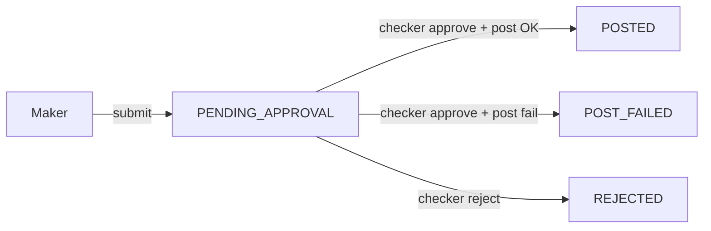

# WS3 Backend: Admin Maker-Checker (ledger adjustments only — NOT SAP)

Scope is **backend only** (dynamic-offer-driver-app + provider-dashboard CommonAPIs / handlers). Control-centre / frontend UI is **out of scope**.

**This doc covers WS3 sub-item (a) only** — typed maker→checker manual ledger adjustments (submit / list / approve+post / reject), immutable audit via ledger, category chart, doc field. **SAP / ERP posting, ride-revenue JVs, `sap_journal_entry` admin reports, and settlement-file / unified finance-search APIs are out of scope** (separate WS3 follow-up).

**Baseline:** `backend/feat/admin-maker-checker-v2` branch.

Finance-kernel stays **storage + helpers only** (`EntryType.Adjustment`, `Finance.adjustment`). HTTP lives at dashboard + `Domain/Action/Dashboard/Management`.

## Goal

Finance admins need to manually credit/debit a driver’s (or FO) wallet for ops exceptions (ride/payout/TDS/incentive/misc), without a single person both creating and applying the change. **Maker** and **checker** are two different dashboard finance users (person accounts behind ApiAuthV2): the maker creates the adjustment request; the checker reviews and approves or rejects it — the same person cannot do both. The feature stores a typed adjustment **request**, and only on checker approve posts one balanced ledger entry (`Finance.adjustment`) for audit.

## Flow

1. **Maker** `POST /finance/adjustment/submit` → row `PENDING_APPROVAL` (`adminMakerId` set; optional `documentId` / `referenceId`).
2. **List** `GET /finance/adjustment/list` (filters; can hide maker’s own pending via `excludeCurrentAdminMaker`).
3. **Checker** (≠ maker) either:
   - `POST .../approve` → ledger post → `POSTED` + `ledgerEntryId`, or `POST_FAILED` + `errorMessage` if post throws;
   - `POST .../reject` → `REJECTED`.
4. Corrections after post: new request / ledger **reversal** (LAW-2), not UPDATE of the entry.



## Decisions locked in

- Dedicated table `ledger_adjustment_request` — **not** reusing fleet `AlertRequest` / `approval_request`.
- Spec + domain live in **dynamic-offer-driver-app** (not `finance-kernel/spec` as the build-plan sketch suggested) — keep that placement.
- Business logic in [`SharedLogic/Finance/LedgerAdjustment.hs`](Backend/app/provider-platform/dynamic-offer-driver-app/Main/src/SharedLogic/Finance/LedgerAdjustment.hs); post via `Finance.adjustment` (LAW-1 one balanced entry; LAW-2 corrections = reversal, not UPDATE).
- Status flow today: `PENDING_APPROVAL` → `POSTED` | `POST_FAILED` | `REJECTED`. `APPROVED` / `approvedAt` — unused, removed from spec.
- Maker ≠ checker enforced on approve/reject; Redis locks on submit/approve/reject; duplicate guard on `referenceId` for in-flight/posted statuses.
- RBAC MVP: `ApiEntity.FINANCE_MANAGEMENT` + access-matrix rows for adjustment actions; no new `FINANCE_MAKER` / `FINANCE_CHECKER` roles unless product requires (see Open questions).

| Reuse | Net-new |
|-------|---------|
| Ledger `createEntryWithBalanceUpdate` / LAW-1–2 | `ledger_adjustment_request` + SharedLogic (**done** in `8a37fdd`) |
| | `Finance.adjustment` + `EntryType.Adjustment` (**done**) |
| | Dashboard adjustment APIs (**done**) |
| `FINANCE_MANAGEMENT` + media `Image` id | Maker/checker capability polish (**done**) |
| Dashboard `withTransactionStoring` / ApiAuthV2 patterns | Provider-dashboard → BPP client wiring (**done**) |

## Status snapshot

| Piece | Status |
|-------|--------|
| Storage YAML / Beam / queries / Extra | **Done** |
| SharedLogic submit / list / approve / reject | **Done** (TdsReimbursement post stubbed) |
| CommonAPIs `FinanceManagement.yaml` endpoints | **Done** |
| Driver-app dashboard handlers | **Done** |
| Provider-dashboard client calls | **Done** (`requestorId` / `requestorName` from `apiTokenInfo`) |
| `documentId` existence check | **TODO** in code |
| Adjustment capability seeds / maker≠checker roles | **Partial** (Local_API matrix rows only) |
| Hand-written numbered migration | **Missing** (migrations-read-only only) |

---

## 1. Storage — `LedgerAdjustmentRequest`

**Done.** Spec: [`driver-app spec/Storage/LedgerAdjustmentRequest.yaml`](Backend/app/provider-platform/dynamic-offer-driver-app/Main/spec/Storage/LedgerAdjustmentRequest.yaml).

```yaml
LedgerAdjustmentRequest:
  tableName: ledger_adjustment_request
  types:
    AdjustmentCategory:
      enum: "RideRelatedCredit,RideRelatedDebit,PayoutRelatedCredit,PayoutRelatedDebit,TdsReimbursementCredit,TdsReimbursementDebit,IncentiveCredit,IncentiveDebit,MiscellaneousCredit,MiscellaneousDebit,TdsDeductionDebit"
    AdjustmentDirection:
      enum: "Credit,Debit"
    AdjustmentRequestStatus:
      enum: "PENDING_APPROVAL,REJECTED,POSTED,POST_FAILED"
  fields:
    id: Id LedgerAdjustmentRequest
    personId: Id Person
    category: AdjustmentCategory
    direction: AdjustmentDirection
    amount: HighPrecMoney
    currency: Currency
    description: Maybe Text
    # Optional business reference (ride id, payout id, etc.) for search / audit
    referenceType: Text
    referenceId: Maybe Text
    # Supporting document image
    documentId: Maybe (Id mage)
    # Maker-checker (dashboard person ids + display names)
    adminMakerId: Id Person
    adminMakerName: Text
    adminCheckerId: Maybe (Id Person)
    adminCheckerName: Maybe Text
    status: AdjustmentRequestStatus # status is NOT a secondary key (rule 11)
    errorMessage: Maybe Text
    # Populated after successful approve + ledger post
    ledgerEntryId: Maybe (Id LedgerEntry)
    merchantId: Id Merchant
    merchantOperatingCityId: Id MerchantOperatingCity
    approvedAt: Maybe UTCTime
    postedAt: Maybe UTCTime
```

Generated under `src-read-only/`; Extra list/filter queries in [`LedgerAdjustmentRequestExtra.hs`](Backend/app/provider-platform/dynamic-offer-driver-app/Main/src/Storage/Queries/LedgerAdjustmentRequestExtra.hs). Migration-read-only: [`ledger_adjustment_request.sql`](Backend/dev/migrations-read-only/dynamic-offer-driver-app/ledger_adjustment_request.sql).

**Remaining**

1. Add numbered migration under `Backend/dev/migrations/dynamic-offer-driver-app/` if deploy path does not apply read-only SQL alone.

---

## 2. SharedLogic — submit / approve / reject / list

**Done.** [`LedgerAdjustment.hs`](Backend/app/provider-platform/dynamic-offer-driver-app/Main/src/SharedLogic/Finance/LedgerAdjustment.hs):

- `ledgerAdjustmentSubmit` / `ledgerAdjustmentList` / `ledgerAdjustmentApproveAndPost` / `ledgerAdjustmentReject`
- Category ↔ direction validation; wallet enabled; amount/currency checks; ride/payout/incentive caps; misc needs description **or** `documentId`
- Approve: lock → re-fetch `PENDING_APPROVAL` → post → `POSTED` + `ledgerEntryId`, or `POST_FAILED` + `errorMessage`

### Category → ledger legs (as implemented)

Credit posts From→To via `Finance.adjustment`; Debit reverses amount (same account pair).

| Category | From (Dr on Credit) | To (Cr on Credit) | Notes |
|----------|---------------------|-------------------|-------|
| RideRelated* | `SellerExpense` | `OwnerLiability` | booking / cancellation charge refs |
| PayoutRelated* | `PlatformAsset` | `OwnerLiability` | `WalletPayout` |
| Incentive* | `OwnerExpense` | `OwnerLiability` | `WalletIncentive` |
| Miscellaneous* | `SellerExpense` | `OwnerLiability` | SellerExpense stands in for “Misc Control” |
| TdsDeductionDebit | `GovtDirect` | `OwnerLiability` | same pattern as EndRide TDS |
| TdsReimbursement* | — | — | **post stub** → `LedgerAdjustmentCategoryNotSupported` |

**Remaining**

1. Implement TdsReimbursement Credit/Debit posting + WS8 doc validation (blocked on WS8 TDS amounts/docs).

---

## 3. Dashboard APIs

**Done (spec + driver-app handlers).** [`FinanceManagement.yaml`](Backend/app/dashboard/CommonAPIs/spec/ProviderPlatform/Management/API/FinanceManagement.yaml):

```yaml
  - POST: # LedgerAdjustmentSubmitAPI (maker)
      endpoint: /finance/adjustment/submit
      auth: ApiAuthV2
      request:
        type: SubmitLedgerAdjustmentReq
      response:
        type: APISuccess
      helperApi: # same as public + mandatoryQuery requestorId, requestorName

  - GET: # LedgerAdjustmentListAPI
      endpoint: /finance/adjustment/list
      auth: ApiAuthV2
      query:
        - limit: Int
        - offset: Int
        - adjustmentRequestId: Id LedgerAdjustmentRequest
        - status: AdjustmentRequestStatus
        - personId: Id Person
        - excludeCurrentAdminMaker: Bool
        - category: AdjustmentCategory
        - direction: AdjustmentDirection
        - referenceType: Text
        - referenceId: Text
        - adminMakerId: Id Person
        - adminCheckerId: Id Person
        - from: UTCTime
        - to: UTCTime
      response:
        type: LedgerAdjustmentListRes
      helperApi: # same as public + mandatoryQuery requestorId

  - POST: # LedgerAdjustmentApproveAPI (checker)
      endpoint: /finance/adjustment/{adjustmentRequestId}/approve
      auth: ApiAuthV2
      params:
        adjustmentRequestId: Id LedgerAdjustmentRequest
      response:
        type: APISuccess
      helperApi: # same as public + mandatoryQuery requestorId, requestorName

  - POST: # LedgerAdjustmentRejectAPI (checker)
      endpoint: /finance/adjustment/{adjustmentRequestId}/reject
      auth: ApiAuthV2
      params:
        adjustmentRequestId: Id LedgerAdjustmentRequest
      response:
        type: APISuccess
      helperApi: # same as public + mandatoryQuery requestorId, requestorName

  SubmitLedgerAdjustmentReq:
    - personId: Id Person
    - category: AdjustmentCategory
    - direction: AdjustmentDirection
    - amount: PriceAPIEntity
    - description: Maybe Text
    - referenceType: Text
    - referenceId: Maybe Text
    - documentId: Maybe (Id Image)

  LedgerAdjustmentListRes:
    - summary: Summary
    - adjustmentRequests: [LedgerAdjustmentItem]

  LedgerAdjustmentItem:
    - adjustmentRequestId: Id LedgerAdjustmentRequest
    - personId: Id Person
    - category: AdjustmentCategory
    - direction: AdjustmentDirection
    - amount: PriceAPIEntity
    - description: Maybe Text
    - referenceType: Text
    - referenceId: Maybe Text
    - documentId: Maybe (Id Image)
    - adminMakerId: Id Person
    - adminCheckerId: Maybe (Id Person)
    - adminMakerName: Text
    - adminCheckerName: Maybe Text
    - status: AdjustmentRequestStatus
    - errorMessage: Maybe Text
    - ledgerEntryId: Maybe Text
    - createdAt: UTCTime
    - updatedAt: UTCTime
    - approvedAt: Maybe UTCTime
    - postedAt: Maybe UTCTime
```

Driver-app: [`Domain/Action/Dashboard/Management/FinanceManagement.hs`](Backend/app/provider-platform/dynamic-offer-driver-app/Main/src/Domain/Action/Dashboard/Management/FinanceManagement.hs) → SharedLogic.

Provider-dashboard: [`FinanceManagement.hs`](Backend/app/dashboard/provider-dashboard/src/Domain/Action/ProviderPlatform/Management/FinanceManagement.hs) → `callManagementAPI` helperApi with `requestorId` / `requestorName` from `apiTokenInfo` (**done**).

Errors: `LedgerAdjustmentError` in [`Tools/Error.hs`](Backend/app/provider-platform/dynamic-offer-driver-app/Main/src/Tools/Error.hs) (`LEDGER_ADJUSTMENT_*`, E400).

Access matrix (local): appends in [`Local_API_Management_FinanceManagement.sql`](Backend/dev/migrations-read-only/provider-dashboard/Local_API_Management_FinanceManagement.sql).

**Remaining**

1. Confirm POSTs use `withTransactionStoring` where dashboard policy requires it (already used on submit/approve/reject).
2. Capability-seed rows for adjustment actions if prod uses capability matrix (not only Local_API role).

---

## 4. finance-kernel touchpoints

**Done (minimal).**

- `EntryType` += `Adjustment` in [`LedgerEntry.yaml`](Backend/lib/finance-kernel/spec/Storage/LedgerEntry.yaml)
- `Finance.adjustment` / `transferWithEntryType` in [`FinanceM.hs`](Backend/lib/finance-kernel/src/Lib/Finance/FinanceM.hs)

No `Lib/Finance/Adjustment/*` module — logic stays in driver-app SharedLogic (acceptable deviation from build-plan sketch).

---

## 5. RBAC (adjustment APIs only)

**Partial.**

- `FINANCE_MANAGEMENT` ApiEntity exists; adjustment actions in Local_API matrix.
- `MERCHANT_MAKER` exists; **`MERCHANT_CHECKER` is not in the role enum** (build-plan mention was inaccurate).
- No dedicated `FINANCE_MAKER` / `FINANCE_CHECKER`.

**Remaining**

1. Split submit (maker WRITE) vs approve/reject (checker WRITE) via roles / `UserAccessType` so the same person cannot hold both in prod config (runtime already rejects maker==checker).
2. Seed capabilities for the four adjustment endpoints if that path is used in target envs.

---

## Delivery order

1. `documentId` validation + misc/TDS doc rules
2. Adjustment RBAC / capability seeds
3. Numbered migration if required by deploy
4. TdsReimbursement post when WS8 is ready

---

## Dependencies / risks

- **WS8** — TdsReimbursement post + TDS document validation.
- **WS7** — merchant-side chart of accounts / AccountType semantics (Misc Control stand-in via `SellerExpense`).
- LAW-1: never two single-sided posts per adjustment.
- LAW-2: fix mistakes with reversal, not row UPDATE.
- Approve idempotency: only `PENDING_APPROVAL` under Redis lock; no double-post to `POSTED`.
- Wrong `AccountType` silently moves balance the wrong way — keep/extend unit coverage per category leg.
- Enum append-only for `AdjustmentCategory`.

---

## Out of scope (WS3 remainder — do not implement in this track)

- SAP ride revenue recognition dispatch / daily JVs / GL `accountMapping` ride keys
- `GET /finance/sap/jv/*` or extensions to `sapJournals*`
- Unified `GET /finance/search`, payout list wiring, settlement-file list/download

---

## Open questions

1. **FINANCE_MAKER / FINANCE_CHECKER** new roles vs configure existing roles + access matrix only.
2. **Misc Control account** — keep `SellerExpense` stand-in or introduce a dedicated AccountType when WS7 lands.
