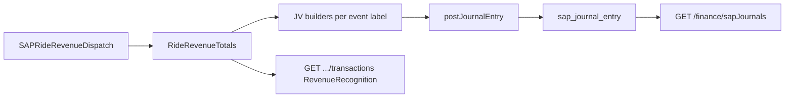

# WS3 Backend: ERP (SAP) ride revenue posting (NOT Maker-Checker)

## Scope

Scope is **backend only** (dynamic-offer-driver-app Allocator + dashboard CommonAPIs / FinanceManagement handlers). Control-centre / frontend UI is **out of scope**.

**This doc covers WS3 sub-items (b) + (c) only** — daily SAP ride-revenue recognition journal vouchers mapping the ride accounting-entry matrix to GL lines, plus the posted-transaction admin report over `sap_journal_entry`. **Maker→checker ledger adjustments, finance-admin RBAC preset, unified finance search, payout-list wiring, and settlement-file store/download are out of scope** (Maker-Checker handled separately; other gaps are separate follow-ups).

**Baseline:** `backend/feat/msil-erp-sap-posting` branch — commits: ERP posting job + `RevenueRecognition` in `/finance/sapJournals/transactions`.

Finance-kernel stays **storage + SAP client helpers**. HTTP lives at dashboard + `Domain/Action/Dashboard/Management`. Dispatch jobs live under Allocator Settlement.

## Goal

Finance ops need ride economics (online rev-rec, offline cash, settlement, driver accrual, payout, TDS) reflected as **balanced SAP journal vouchers**, auditable in SmartRide. A daily Allocator job aggregates the day’s ledger / tax / payout / TDS amounts per merchant operating city, posts one JV per matrix event (when amounts are non-zero), and stores success/failure in `sap_journal_entry`. Admins list those JVs and drill into the source rows that fed each aggregate.

## Flow

1. Allocator runs `SAPRideRevenueDispatch` for `[startTime, endTime)` (typically previous calendar day).
2. Redis day-lock + idempotency key (`RevenueRecognition` + mocId + day) — skip if already dispatched.
3. `fetchRideRevenueTotals` builds per-event aggregates → JV builders (`assertDebitEqualsCredit`) → `postJournalEntry` → `sap_journal_entry` rows with `transactionType = RevenueRecognition` and `description` = event label.
4. Zero-amount events soft-skip (no SAP call).
5. Job schedules the next daily window.
6. Admin: `GET /finance/sapJournals` (filter by `transactionType`, dates, belnr, …) → `GET /finance/sapJournals/transactions?transactionType=RevenueRecognition` (+ optional `description` = JV label).



## Decisions locked in

- **Daily aggregated JVs** for phase-1 (not per-ride posts) — matches build-plan recommendation.
- Shared shell / SAP call / audit helpers extracted to [`SAPDispatchCommon.hs`](Backend/app/provider-platform/dynamic-offer-driver-app/Main/src/SharedLogic/Allocator/Jobs/Settlement/SAPDispatchCommon.hs); subscription + PG stay in [`SAPReportDispatch.hs`](Backend/app/provider-platform/dynamic-offer-driver-app/Main/src/SharedLogic/Allocator/Jobs/Settlement/SAPReportDispatch.hs).
- New job module [`SAPRideRevenueDispatch.hs`](Backend/app/provider-platform/dynamic-offer-driver-app/Main/src/SharedLogic/Allocator/Jobs/Settlement/SAPRideRevenueDispatch.hs) + totals twin [`RideRevenueTotals.hs`](Backend/app/provider-platform/dynamic-offer-driver-app/Main/src/SharedLogic/Allocator/Jobs/Settlement/RideRevenueTotals.hs) (mirrors `SubscriptionTotals.hs`).
- Matrix event identity = **`sap_journal_entry.description` labels** (not a new enum column): `OnlineRideRevRec`, `OfflineCashRide`, `BuyerAppSettlement`, `DriverEarningAccrual`, `PayoutToClearing`, `PayoutClearingToBank`, `TdsDeduction`, `TdsReimbursement`, `SubscriptionRideRevenue`, `SubscriptionExpiryRevenue`.
- `SapJournalEntry.TransactionType` += `RevenueRecognition` (append-only).
- Idempotency: day lock + `idempotencyJobType = "RevenueRecognition"`; every JV builder / `buildJournalRequestFromItems` keeps **debit == credit**.
- Account mapping keys added in migration `0011` (see §4).
- Buyer-app settlement debit phase-1 uses **`BANK A/C`** (matrix also mentioned `BUYER_APP_POOL`; key is seeded but unused in the JV builder today).

| Reuse | Net-new |
|-------|---------|
| `Kernel.External.SAP` (`postJournalEntry`, `accountMapping`, S/H) | `SAPRideRevenueDispatch` + `RideRevenueTotals` (**done**) |
| Existing daily SAP shell patterns (lock, retry, audit) | `SAPDispatchCommon` extract (**done**) |
| `GET /finance/sapJournals/transactions*` | `description` query + `RevenueRecognition` handler branch (**done**) |
| Existing BANK / PG / GST mapping from migration `0006` | Ride + MSIL GL keys via migration `0011` merge (**done**) |
| | BuyerAppSettlement feed (**remaining** / blocked on WS2) |

## Status snapshot

| Piece | Status |
|-------|--------|
| `SAPDispatchCommon` refactor | **Done** |
| `SAPRideRevenueDispatch` + Allocator handler + dhall enable flag | **Done** |
| `RideRevenueTotals` aggregates + row twins for drill-down | **Done** (BuyerAppSettlement still stubbed) |
| `accountMapping` keys (`0011`) | **Done** |
| `TransactionType.RevenueRecognition` in finance-kernel | **Done** |
| `GET /finance/sapJournals` list | **Pre-existing** (works for new txn type) |
| `GET /finance/sapJournals/transactions` | **Pre-existing**; + `description` query + RevenueRecognition handler (**done**; BuyerAppSettlement empty until WS2) |
| Buyer-app settlement totals feed | **Stub** (depends WS2) |
| TDS reimbursement totals / drill-down | **Done** — `fetchTdsTotals` reads DTT `Reimbursed` via `findByTdsTreatmentAndDateRange`; rows persist to `journal_entry_transaction` on successful `TdsReimbursement` JV post |
| `GET /finance/payout/list`, settlement-file APIs, `/finance/search` | **Out of scope** (this doc) |
| Maker-checker / finance RBAC preset | **Out of scope** (Maker-Checker plan; Credit post already writes Reimbursed DTT) |

---

## 1. Allocator job + shared dispatch

**Done.**

- Job type `SAPRideRevenueDispatch` in [`SharedLogic/Allocator.hs`](Backend/app/provider-platform/dynamic-offer-driver-app/Main/src/SharedLogic/Allocator.hs); handler registered in Allocator [`App.hs`](Backend/app/provider-platform/dynamic-offer-driver-app/Allocator/src/App.hs); enabled in [`dynamic-offer-driver-app.dhall`](Backend/dhall-configs/dev/dynamic-offer-driver-app.dhall).
- Shell: `runSAPDispatchShell` with `lockKeyPrefix = "SAPRideRevenueDispatch"`, `idempotencyJobType = "RevenueRecognition"`.
- On success path, `scheduleNextRideRevenueJob` creates the next day’s job.

---

## 2. Totals + ride → SAP GL matrix

**Done (with stubs).** [`RideRevenueTotals.hs`](Backend/app/provider-platform/dynamic-offer-driver-app/Main/src/SharedLogic/Allocator/Jobs/Settlement/RideRevenueTotals.hs) + dispatch in [`SAPRideRevenueDispatch.hs`](Backend/app/provider-platform/dynamic-offer-driver-app/Main/src/SharedLogic/Allocator/Jobs/Settlement/SAPRideRevenueDispatch.hs).

| Event label (`description`) | Debit (S) | Credit (H) | Totals source |
|-----------------------------|-----------|------------|---------------|
| `OnlineRideRevRec` | `BUYER_APP_RECEIVABLE` | `RIDE_FARE_REVENUE` + CGST/SGST/IGST | RideFare ITT ∩ GST/VAT online ledger tax refs |
| `OfflineCashRide` | `DRIVER_BALANCE` | `RIDE_FARE_REVENUE` + CGST/SGST/IGST | Same ITT shape, cash tax refs |
| `BuyerAppSettlement` | `BANK` | `BUYER_APP_RECEIVABLE` | **Stub → 0** (WS2) |
| `DriverEarningAccrual` | `RIDE_FARE_REVENUE` | `DRIVER_BALANCE` | BaseRide OwnerLiability credit legs |
| `PayoutToClearing` | `DRIVER_BALANCE` | `PAYOUT_CLEARING` | SETTLED `WalletPayout` legs |
| `PayoutClearingToBank` | `PAYOUT_CLEARING` | `BANK` | Phase-1: **same** `WalletPayout` total. Intended: `pg_payout_settlement_report` (WS4 file ingest) |
| `TdsDeduction` | `DRIVER_BALANCE` | `TDS_PAYABLE` | `direct_tax_transaction` `Deducted` |
| `TdsReimbursement` | `TDS_RECEIVABLE` | `DRIVER_BALANCE` | `direct_tax_transaction` `Reimbursed` (written at WS3 FO TDS-cert Credit post; amount = `tdsCreditReceivable`) |
| `SubscriptionRideRevenue` | `DEFERRED_REVENUE` | `SUBSCRIPTION_REVENUE` | SETTLED `RideRevenueRecognition` |
| `SubscriptionExpiryRevenue` | `DEFERRED_REVENUE` | `SUBSCRIPTION_REVENUE` | SETTLED `ExpiryRevenueRecognition` |

Zero amounts skip posting. Ride-fare builders also assert `gross == net + cgst + sgst + igst` before the shared request builder’s Dr==Cr check.

TDS fetch uses generated [`findByTdsTreatmentAndDateRange`](Backend/lib/finance-kernel/spec/Storage/DirectTaxTransaction.yaml) (Deducted + Reimbursed in the same window). Reimbursed DTT rows are created by `postTdsReimbursementAdjustment` alongside the ledger Credit (Dr TDS Receivable / Cr FO wallet).

**Remaining**

1. Implement `fetchBuyerAppSettlementTotals` (+ drill-down) when WS2 settlement feed exists.
2. Decide whether settlement debit should ever use `BUYER_APP_POOL` instead of / in addition to `BANK`.

---

## 3. Dashboard APIs (`sapJournals*`)

**Mostly pre-existing.** Endpoints `GET /finance/sapJournals` and `GET /finance/sapJournals/transactions` already existed (subscription / PG drill-down). Spec: [`FinanceManagement.yaml`](Backend/app/dashboard/CommonAPIs/spec/ProviderPlatform/Management/API/FinanceManagement.yaml). Handlers: [`FinanceManagement.hs`](Backend/app/provider-platform/dynamic-offer-driver-app/Main/src/Domain/Action/Dashboard/Management/FinanceManagement.hs).

**Net-new in this track (spec):** optional query on transactions only:

```yaml
        description: Text   # JV label filter; RevenueRecognition only
```

**Net-new in handlers:** `transactionType=RevenueRecognition` branch — `description` absent → concat all `rideRevenueJvLabels`; present → one label’s row fetcher (invalid → `InvalidRequest`). `BuyerAppSettlement` stays empty until WS2. `TdsReimbursement` drill-down is populated from `journal_entry_transaction` after a successful daily JV post (source rows come from DTT `Reimbursed`). Keep totals WHERE in sync with row Extra queries.

**Remaining**

1. Fill empty BuyerAppSettlement drill-down when WS2 lands.

---

## 4. Config / migration

**Done.** [`0011-add-sap-ride-revenue-account-mapping.sql`](Backend/dev/migrations-after-release/dynamic-offer-driver-app/0011-add-sap-ride-revenue-account-mapping.sql) jsonb-merges into `SAP_Journal.accountMapping` for `MSIL_PARTNER` / Hyderabad (cannot edit applied `0006` — right-hand `||` overwrites shared keys). Keys (code uses `"… A/C"` suffix):

`BANK`, `PG_CLEARING`, `DEFERRED_REVENUE`, `CGST_PAYABLE`, `SGST_PAYABLE`, `IGST_PAYABLE`, `BUYER_APP_RECEIVABLE`, `BUYER_APP_POOL`, `RIDE_FARE_REVENUE`, `DRIVER_BALANCE`, `PAYOUT_CLEARING`, `TDS_PAYABLE`, `TDS_RECEIVABLE`, `SUBSCRIPTION_REVENUE`.

---

## 5. finance-kernel touchpoints

**Done (minimal).**

- [`SapJournalEntry.yaml`](Backend/lib/finance-kernel/spec/Storage/SapJournalEntry.yaml): `TransactionType` += `RevenueRecognition`.
- [`DirectTaxTransaction.yaml`](Backend/lib/finance-kernel/spec/Storage/DirectTaxTransaction.yaml): `findByTdsTreatmentAndDateRange` for Deducted / Reimbursed SAP windows.
- Extra queries used by drill-down / aggregates: `DirectTaxTransactionExtra` (`findByReferenceIds`), `LedgerEntryExtra` (row twins for payout / ride legs).

No new HTTP in finance-kernel.

---

## Delivery order (remaining)

1. BuyerAppSettlement when WS2 ready
2. BANK vs BUYER_APP_POOL product call

---

## Dependencies / risks

- **WS2** — buyer-app settlement amounts (totals + transactions drill-down).
- **WS8 + maker-checker** — FO TDS-cert submit + Credit adjustment must post before Reimbursed DTT rows exist for the SAP day window (already implemented; SAP totals only read DTT).
- **WS4** — payout channel/gating may change eligibility later; phase-1 aggregates SETTLED `WalletPayout` only (commented as intentional).
- Missing / wrong `accountMapping` key → `mkItem` / post throws for that day’s event.
- GST mis-split breaks Dr==Cr assertion — keep assertion on every new JV builder.
- Idempotency is **per day / moc / job type**; re-run after a partial failure needs ops clarity (failed rows in `sap_journal_entry` vs day already marked dispatched).
- Enum append-only for `TransactionType` / JV labels treated as stable API contract for `description` filter.

---

## Out of scope (do not implement in this track)

- Maker-checker ledger adjustments (`ledger_adjustment_request`, submit/approve/reject) — see Maker-Checker plan
- Finance-admin RBAC preset / `FINANCE_MAKER`/`CHECKER` roles
- `GET /finance/search`
- Wiring unused `PayoutListRes` / settlement-file list-download (WS3 (e) leftovers)
- Per-ride (non-aggregated) SAP posts
- Control-centre UI

---

## Open questions

1. **BANK vs BUYER_APP_POOL** for buyer-app settlement debit (and whether accrual should ever debit pool instead of `RIDE_FARE_REVENUE`).
2. **Partial-day failure** — if one event label posts and another fails, is day-level idempotency still correct, or do we need per-label idempotency keys.
3. **Payout / settlement-file admin APIs** — keep as a separate small track, or fold into a later WS3 cleanup doc (not required for sapJournals drill-down).
