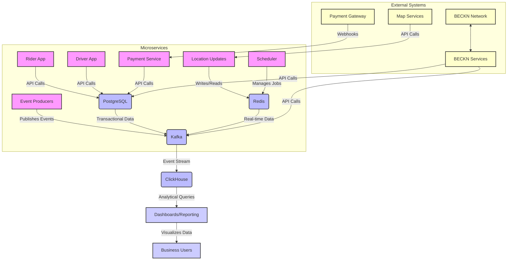

# Nammayatri Backend - Database Overview

The Nammayatri backend leverages a polyglot persistence strategy, utilizing different database technologies tailored to specific data storage, retrieval, and processing needs. This document details the key databases used, their primary roles, and how they are integrated and utilized within the project.

## 1. PostgreSQL

**Role:** The primary relational database for transactional data, core business logic, and structured domain models.

**Why Chosen & How Utilized:**
*   **ACID Compliance:** Ensures data consistency, integrity, atomicity, and durability, which is critical for financial transactions, ride bookings, and user management.
*   **Complex Querying:** Its robust SQL capabilities, enhanced by Esqueleto's type-safe DSL, allow for complex joins, aggregations, and filtering necessary for intricate business logic.
*   **Structured Data:** Ideal for storing highly structured data with well-defined schemas and relationships.
*   **Geospatial Capabilities:** Utilized for storing and querying geographical data (e.g., `geom` fields for special locations and gates), supporting location-based services and geospatial queries (e.g., `containsPoint`).
*   **Extensibility:** Supports custom data types and extensions (e.g., `PostgresList` for storing arrays of custom Haskell types).

**Key Database Names/Schemas:**
*   `atlas_app`: Likely contains core application data related to the rider platform, general users, and common entities.
*   `atlas_driver_offer_bpp`: Likely contains data specific to the driver/provider platform, including driver information, offers, and allocation-related data.

**Key Tables (Examples from scanned files):**
*   **`payment_order`**: Stores details of payment orders.
    *   **Description:** Records initiated payment requests, amounts, currencies, status, associated persons/merchants, payment links, and mandate details.
    *   **Key Fields:** `id` (PK, Text), `shortId` (Text), `personId` (Text), `merchantId` (Text), `amount` (HighPrecMoney), `currency` (Currency), `status` (TransactionStatus), `paymentServiceOrderId` (Text), `clientAuthTokenEncrypted` (Text, encrypted), `clientAuthTokenHash` (DbHash).
*   **`payment_transaction`**: Stores details of individual payment transactions.
    *   **Description:** Records granular transaction details linked to payment orders, including status, payment method, gateway reference, and Juspay response.
    *   **Key Fields:** `id` (PK, Text), `orderId` (Text, FK to `payment_order`), `status` (TransactionStatus), `amount` (HighPrecMoney), `txnId` (Text), `juspayResponse` (Value, JSON dump).
*   **`payout_order`**: Stores information about payout orders.
    *   **Description:** Manages financial payouts to drivers or other entities, including status, entity names, and last checked timestamps.
    *   **Key Fields:** `id` (PK, Text), `customerId` (Text), `status` (PayoutOrderStatus), `entityName` (EntityName), `entityIds` (PostgresList Text), `lastStatusCheckedAt` (UTCTime).
*   **`refunds`**: Stores details of refund transactions.
    *   **Description:** Records refund amounts, statuses, and associated error messages.
    *   **Key Fields:** `id` (PK, Text), `orderId` (Text, FK to `payment_order`), `refundAmount` (HighPrecMoney), `status` (RefundStatus).
*   **`special_location`**: Stores information about special geographical zones.
    *   **Description:** Defines named geographical areas (e.g., airports, railway stations) with categories, linked locations, and geospatial geometry.
    *   **Key Fields:** `id` (PK, Text), `locationName` (Text), `category` (Text), `geom` (Text, geospatial data), `linkedLocationsIds` (PostgresList Text), `locationType` (SpecialLocationType).
*   **`gate_info`**: Stores details about gates within special locations.
    *   **Description:** Defines specific entry/exit points within special locations, including their coordinates, names, and queuing properties.
    *   **Key Fields:** `id` (PK, Text), `specialLocationId` (Text, FK to `special_location`), `point` (LatLong), `name` (Text), `geom` (Text, geospatial data).
*   **`special_location_priority`**: Stores priority configurations for special locations.
    *   **Description:** Defines pickup and drop priorities for specific categories within special locations.
    *   **Key Fields:** `id` (PK, Text), `merchantId` (Text), `merchantOperatingCityId` (Text), `category` (Text), `pickupPriority` (Int), `dropPriority` (Int).

## 2. Redis

**Role:** An in-memory data structure store used for caching, session management, real-time data, and job scheduling.

**Why Chosen & How Utilized:**
*   **Low Latency:** Provides extremely fast read/write operations, essential for real-time features like location updates and high-throughput caching.
*   **Caching:** Reduces load on PostgreSQL by storing frequently accessed data, improving response times.
*   **Ephemeral Data:** Ideal for temporary data like session states, OTPs, and intermediate calculation results.
*   **Job Queues/Scheduling:** Used by the `scheduler` module for managing background jobs and their states.
*   **Pub/Sub:** Supports publish/subscribe messaging patterns, potentially used for real-time notifications or event propagation within the system.

**Key Data Handling Patterns:**
*   **Key-Value Store:** Used as a simple key-value store for various data.
*   **Location Updates:** Stores driver location data and intermediate waypoints for distance calculation (`lib/location-updates/`). Keys are often derived from `Id Person` (driver ID).
*   **Scheduler Jobs:** Manages the state and queues of scheduled jobs.
*   **Test Isolation:** In tests, Redis keys are often prefixed (e.g., `locationUpdatesTest:`) to ensure test data isolation.

## 3. ClickHouse

**Role:** A columnar database primarily used for analytical workloads, event tracking, and metrics.

**Why Chosen & How Utilized:**
*   **High-Throughput Ingestion:** Designed for very fast ingestion of large volumes of data, making it suitable for event streams from Kafka.
*   **Fast Analytical Queries:** Its columnar storage and vectorized query execution enable extremely fast aggregation and analytical queries over massive datasets, crucial for real-time analytics and dashboards.
*   **Scalability:** Horizontally scalable to handle growing data volumes and query loads.
*   **Event Tracking:** Stores detailed event data (e.g., from `lib/sessionizer-metrics/`) for supply-demand analysis, congestion monitoring, and other business intelligence purposes.

**Key Data Handling Patterns:**
*   **Event Data:** Stores raw and processed event data, often ingested from Kafka topics.
*   **Metrics:** Aggregates and stores various operational and business metrics.
*   **Dashboards:** Serves as the data source for Grafana and other analytical dashboards.

## 4. Database Interaction Patterns (Haskell)

The backend interacts with these databases using a consistent set of Haskell libraries and patterns:

*   **ORM/Query Builders:**
    *   **Beam:** Used for defining table schemas and basic CRUD operations in a type-safe manner.
    *   **Esqueleto:** Provides a powerful, type-safe embedded DSL for constructing complex SQL queries, including joins, aggregations, and geospatial functions.
    *   **`Kernel.Storage.Hedis.Queries`:** Provides a type-safe interface for interacting with Redis.
*   **Custom Mapping Layers:**
    *   `ToTType`, `FromTType`, `TEntityKey`, `ToTType'`, `FromTType'`: Custom type classes that define explicit bidirectional mappings between Haskell domain models and their database representations. This ensures a clean separation of concerns and handles complex data transformations (e.g., `PostgresList`, encrypted fields).
*   **Encryption:** Sensitive data fields (e.g., `clientAuthTokenEncrypted`, `mobile_number_hash`) are encrypted or hashed using `Kernel.External.Encryption` before being stored in PostgreSQL, providing a layer of data security.
*   **Monadic Contexts:** Database operations are performed within specific monadic contexts (e.g., `SqlDB`, `BeamFlow m r`, `TestM` for tests), which manage database connections, transactions, and error handling.
*   **Template Haskell:** Used to automatically generate boilerplate code for database schema definitions (`mkPersist` with quasi-quoters) and instance derivations (`derivePersistField`, `mkTableInstancesGenericSchema`), reducing manual effort and ensuring consistency.

## 5. Key Interactions and Data Flow Between Databases

The different databases in the Nammayatri backend are not isolated but interact in specific ways to support the overall system functionality.

### PostgreSQL and Redis

*   **Caching Layer:** Redis acts as a caching layer for data primarily stored in PostgreSQL. Frequently accessed data from PostgreSQL (e.g., user profiles, configuration settings, real-time location updates) can be cached in Redis to reduce direct database load and improve read performance.
*   **Real-time Data:** For highly dynamic data like driver locations, updates might first be written to Redis for low-latency access by real-time services. Periodically, or upon specific events, this data might be synchronized back to PostgreSQL for long-term persistence and transactional integrity.
*   **Scheduler State:** The `scheduler` module might use Redis for managing job queues and ephemeral job states, while long-running job definitions or historical job execution logs are stored in PostgreSQL.

### PostgreSQL and ClickHouse

*   **Transactional to Analytical Data Flow:** Core transactional data from PostgreSQL (e.g., completed rides, payment statuses) is often transformed and ingested into ClickHouse for analytical purposes. This typically happens via an event-driven pipeline.
*   **Event Sourcing for Analytics:** Business events (e.g., ride created, payment charged) are first recorded in PostgreSQL as part of the transactional process. These events are then often streamed to Kafka, from where they are consumed and loaded into ClickHouse. This allows for detailed historical analysis without impacting the performance of the operational PostgreSQL database.
*   **Reporting and Dashboards:** ClickHouse serves as the backend for analytical dashboards (e.g., Grafana), providing fast aggregations and insights over large volumes of historical data that originated from PostgreSQL.

### Redis and Kafka

*   **Real-time Event Buffering:** Redis might be used as a temporary buffer for real-time events before they are pushed to Kafka, especially for high-volume, low-latency event streams.
*   **Event Stream Processing:** Data from Kafka event streams might be processed by consumers that then update cached data in Redis for quick access by other services.
*   **Metrics and Monitoring:** Real-time metrics generated by services might be temporarily stored in Redis before being aggregated and pushed to Kafka for further processing or ingestion into ClickHouse/Prometheus.

### Kafka and ClickHouse

*   **Primary Analytical Ingestion:** Kafka serves as the primary ingestion pipeline for analytical data into ClickHouse. Events and metrics produced by various microservices are streamed to Kafka topics, and then consumed by ClickHouse for real-time analytics. This decouples the data producers from the analytical database.

### Overall Data Flow Diagram (Conceptual)

