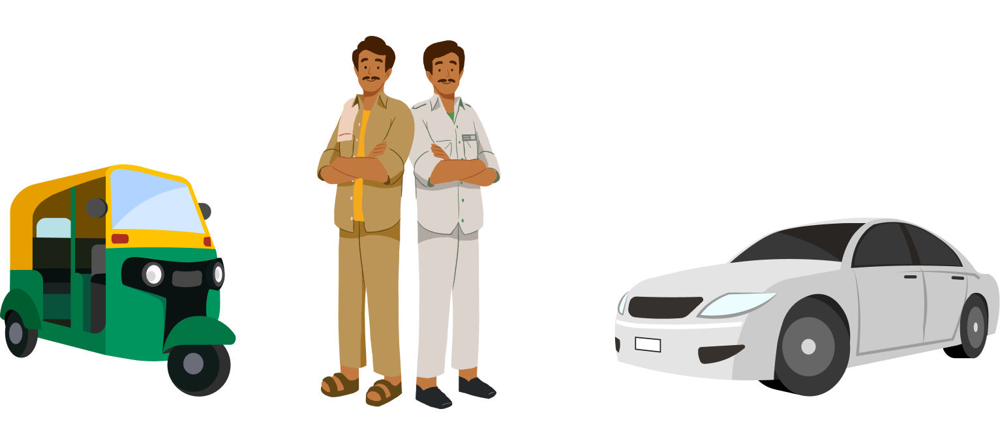
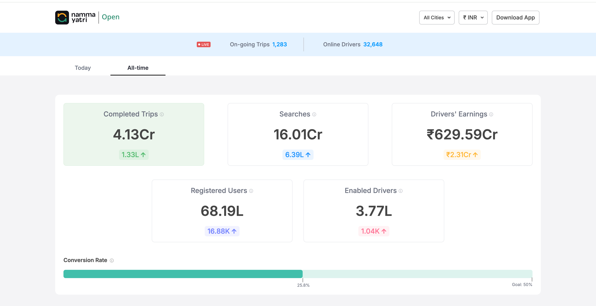
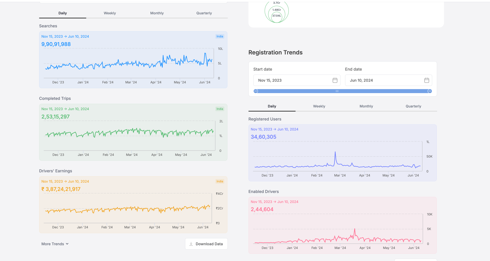

# 🛺 Namma Yatri 🚖

**Open and Driver Centric Mobility Platform**

## 🌟 Vision
Namma Yatri aims to empower service providers with a high-tech, cost-effective app and open data platform. Our vision is centered on the following principles:

1. **Zero Commission**: Ensuring no commission fees for drivers, promoting fair earnings and economic empowerment for service providers.
2. **Open**: Utilizing open data platforms, open code, and open networks to foster transparency, innovation, and collaboration within the community.
3. **Optimize**: Achieve population scale growth with utility-like pricing by continuously optimizing maps, cloud, and development costs, all while maintaining high reliability and rich user experience.
4. **Multimodal**: Supporting various modes of transport to provide comprehensive, integrated mobility solutions for a seamless user experience.
5. **Shared Transport**: Promoting shared mobility options to reduce traffic congestion, lower costs, and minimize carbon emissions, contributing to a sustainable future.

As engineers, we often seek opportunities where one person can serve millions of others. Namma Yatri is an effort to enable the careers of those who serve one-to-one, like auto drivers who transport people each and every day. These drivers indirectly serve millions of customers over time.

Here is a [video from our founder](https://www.youtube.com/watch?v=NnyoxiiZLZg) explaining the vision of Namma Yatri:

## 🌱 Core Values

### 👥 Community-first
Mobility must be owned by the community of citizens and drivers who collaborate to create a thriving, equitable, and sustainable environment. Participatory development from the community helps build products to solve large-scale problems like mobility.

### 🚗 Citizens as owners
Drivers invest in their vehicles and work hard every day. Citizens pay for and use the service. They both should own the platform, offering quality service at a fair price, without intermediaries dictating terms or prices.

### 👐 Open Platform
Customers shall participate in community efforts by using the open system, providing feedback, and improving drivers' lives. Our data and roadmap will be open for feedback. The team will strive to be efficient, prioritize the critical few, and do more with less.

### 💡 Tech and People are enablers
Mobility is an engineering problem, and technology can make it more efficient, reliable, and sustainable. We need both tech innovations and human involvement. Empathy and support for both citizens and drivers are crucial.

### 🌍 Sustainable Growth
We aim to solve complex, long-term problems sustainably, avoiding unsustainable tactics like discounts and incentives. We pursue initiatives that are financially, environmentally, and psychologically sustainable, promoting shared mobility and efficient public transportation to reduce traffic, cost, and carbon emissions.

## ❓ Why Solve This Problem?
Mobility is critical to economic growth, social progress, and individual well-being. People's livelihoods depend on mobility, but current systems could be more efficient, sustainable, and accessible to the masses. To improve this, mobility should be community-driven, open, tech-enabled, and shared.

Join us in this endeavor to transform mobility. We look forward to your contribution and support!

## 🎯 Milestone and Growth
With an ever-increasing number of rides facilitated, our platform is demonstrating its effectiveness and scalability. You can explore the real-time data and see the traction [here](https://nammayatri.in/open/?rides=All&tl=at).

Here are some snapshots of our dashboard:

*Comprehensive overview of the total rides completed, registered users, searches, and drivers' earnings.*

*Daily trends of searches, completed trips, drivers' earnings, registered users, and enabled drivers, showing detailed metrics over time.**

## 🤝 Get Involved
Explore the code, provide feedback, and contribute to the project. Together, we can create a scalable, efficient, safe, and sustainable transportation network for our city.

### Community Engagement
Join our [GitHub Discussions](https://github.com/orgs/nammayatri/discussions) to ask questions and explore ideas.

### Project Setup
Instructions to build and run the project can be found in the sub-project directories - [Backend](https://github.com/nammayatri/nammayatri/blob/main/Backend/README.md#getting-started) and [Frontend](https://github.com/nammayatri/nammayatri/blob/main/Frontend/README.md).

### Contributing Guidelines
We believe in the power of open-source. This repository aims to foster an open development platform for the mobility stack, where anyone can inspect and contribute. We welcome contributions in the form of bug reports, code patches, documentation updates, feature requests, and notifications of breaking changes in dependencies. Please read our [contributing guidelines](https://github.com/nammayatri/nammayatri/blob/main/docs/CONTRIBUTING.md) before you start.

Happy Contributing

## ✨ Thanks to all contributors

Thank you for your support in nammayatri's growth. Keep up the great work! 🥂

